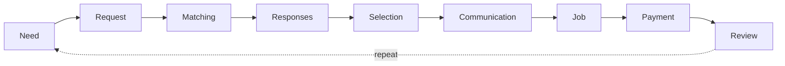
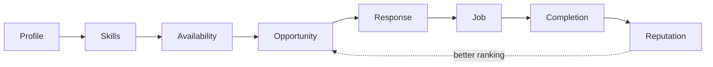

# Project DeyDo: Product Vision & Strategy

| Field | Value |
|---|---|
| Working title | Project DeyDo (final name TBD) |
| Status | Pre-brand, pre-validation |
| Document owner | Joshua (founder) |
| Last updated | 2026-10-04 |
| Companion document | [`technical-architecture.md`](./technical-architecture.md) |

> **How to read this document.** Everything here is a hypothesis until Phase 0 research says otherwise. Statements marked **[Assumption]** have not been validated. Statements marked **[Decision]** are current choices that can be revisited through the Decision Log (Section 22). No traction, users, revenue or partnerships exist yet, and none are implied.

---

## 1. Executive Summary

**What it is.** DeyDo is a Nigerian-first marketplace that turns a stated need ("my AC is leaking", "I need a logo for my restaurant") into a matched, completed and reviewed job with a skilled provider. It covers on-site work (repairs, trades, beauty, tutoring), remote work (design, development, writing) and hybrid work under one request flow.

**What problem it solves.** In Nigeria, finding a trustworthy skilled person mostly runs through WhatsApp, personal referrals and social media. That works when you already know someone, and fails when you do not. Customers cannot judge quality before hiring, have no recourse when a job goes wrong, and repeat the search every time. Skilled people, especially artisans and early-career freelancers, have no portable record of their work, so their reputation is trapped inside the networks of their past customers.

**Why it matters.** Services are bought frequently, often urgently, and the cost of a bad hire is high (damaged appliances, lost deposits, wasted days). The information gap between buyer and seller is the core inefficiency. Whoever closes it with reliable reputation data earns a durable position.

**Who it serves.** Households and individuals who need things done; small businesses that buy services but have no procurement function; and skilled providers ranging from roadside technicians to professional freelancers.

**Why Nigeria first.** The founder is based in Nigeria and understands the market, payment rails and informal trust dynamics firsthand. The market is large and connected: the NCC reported about 157.4 million active internet subscriptions and 56.11% broadband penetration as of May 2026 ([ThisDay, citing NCC](https://www.thisdaylive.com/2026/08/27/internet-subscribers-hit-157-4m-as-broadband-penetration-increases-to-56-11/)). Note that subscriptions are not unique people, since many Nigerians hold multiple SIMs. Local payment infrastructure (Paystack, Flutterwave) is mature enough to support in-platform payments when we need them.

**Long-term opportunity.** If DeyDo becomes the place where service work is recorded and reviewed, the asset is not the listing directory. It is the verified history of who did what work, for whom, how well. That history can become a reputation layer for skilled workers, a demand channel for small service businesses and, eventually, a foundation for adjacent services (payments, financing, insurance). That outcome is years away and depends entirely on first winning a narrow market.

**The honest summary.** The idea is not new. At least eight Nigerian products currently pitch some version of "verified providers, escrow, reviews" (Section 12), and earlier attempts shut down when they ran out of money before reaching liquidity. DeyDo will only succeed by out-executing on density in a narrow wedge, not by having a broader vision.

---

## 2. Product Thesis

### 2.1 Central belief

> People with useful skills should be able to be discovered by people who need those skills, regardless of whether the work is digital or physical, and the record of work they do should follow them.

### 2.2 Why this is a demand-to-supply marketplace, not a freelance platform

Freelance platforms (Fiverr, Upwork) are **supply-first**: providers publish gigs or profiles, buyers browse a catalogue. That model works for remote digital work, where the buyer already knows roughly what to search for and location is irrelevant.

Local service markets behave differently:

| Dimension | Freelance platform (supply-first) | DeyDo (demand-first) |
|---|---|---|
| Starting point | Buyer browses catalogue | Buyer states a need |
| Buyer knowledge | Knows the service category | Often only knows the symptom ("generator won't start") |
| Location | Irrelevant | Often the primary constraint |
| Urgency | Days to weeks | Hours to days |
| Pricing | Fixed packages | Usually quoted after diagnosis |
| Unit of value | A gig or contract | A completed job with an outcome |

The thesis is that **the request is the atomic unit**, not the profile. Matching starts from what the customer needs, in their words, and routes it to providers who can do it, where it needs doing, when it needs doing.

### 2.3 Thesis risks (stated up front)

1. **[Assumption]** Customers will post requests on a platform instead of messaging the one person they already know. If most demand is satisfied by existing networks, the addressable demand is only the "I don't know anyone" segment.
2. **[Assumption]** A single product can serve on-site and remote work without diluting both. These are different businesses with different liquidity mechanics. Section 10 argues we should launch with one and design for both.
3. **[Assumption]** Providers will keep transacting through the platform after the first introduction. Disintermediation is the default failure mode for local service marketplaces.

---

## 3. Problem

### 3.1 Problems by stakeholder

| Stakeholder | Core problem | Consequence |
|---|---|---|
| **Skilled individuals (general)** | Demand arrives irregularly and only through people who already know them | Idle days, income volatility, inability to plan |
| **Freelancers** | Global platforms are crowded, charge high fees and are awkward to get paid from in Nigeria (see 3.2) | High acquisition cost per client; local clients found only via referral |
| **Artisans** | No portfolio or record; trust is personal, not portable; price haggling from a weak position | Reputation resets when they move areas; good work goes unrecorded |
| **Professionals** (accountants, lawyers, consultants) | Discovery depends on networks; little structured lead flow for small engagements | Small clients underserved; professionals overpay for marketing |
| **Small businesses** | No procurement function; hire via owner's contacts; no records of vendor performance | Inconsistent quality, rework, no way to compare vendors |
| **Customers (households)** | Cannot verify competence or honesty before letting someone into their home or handing over a device | Fear of being cheated; reliance on a tiny network; repeated bad experiences |
| **People seeking trusted providers** (new to a city, diaspora managing family needs) | Have no local network at all | Overpay, or delay needed work |

### 3.2 Current alternatives

| Alternative | Why people use it | Where it fails |
|---|---|---|
| **WhatsApp** (direct chats, status, groups) | Free, universal, conversational, already installed | No discovery beyond your contacts; no structured reviews; no recourse; history lost in chat |
| **Word of mouth** | Highest trust signal available | Limited to your network's reach; slow; one person's experience |
| **Facebook groups** | Large local audiences; "can anyone recommend a…" posts | Recommendations are noisy, gameable and unstructured; no accountability after the job |
| **Instagram** | Visual portfolios for beauty, fashion, design, events | Discovery favours marketing skill over service quality; follower counts are not job records |
| **Informal referrals** (estate managers, church, colleagues) | Trusted intermediary | Intermediary may take a cut or favour relatives; no transparency |
| **Fiverr** | Global demand for digital work | 20% seller commission plus buyer fees ([Vaultleap](https://vaultleap.com/blog/fiverr-fees-explained-2026)); irrelevant for on-site work; heavy global competition |
| **Upwork** | Global contracts for professionals | Variable 0% to 15% freelancer fee ([Upwork](https://support.upwork.com/hc/en-us/articles/211062538-Freelancer-Service-Fees)) plus paid Connects; Nigerian payout friction, including PayPal limitations ([Techeconomy](https://techeconomy.ng/best-platform-to-withdraw-from-upwork-in-nigeria-2026)) |
| **Local marketplaces** (Section 12) | Purpose-built for Nigerian services | Mostly early stage with low visible traction; none has clearly won a city |
| **Personal networks** | Free and trusted | Exhausted quickly; worthless when you move or need a rare skill |

### 3.3 Why the current landscape is fragmented

The useful information exists but is scattered: competence lives in WhatsApp chats, portfolios on Instagram, recommendations in Facebook threads and history in people's memories. None of it is structured, verified or portable. Each channel solves one step (discovery, or communication, or showcasing) and none closes the loop from **need to completed job to recorded reputation**. That closed loop is the product.

---

## 4. Target Users

Personas are **[Assumption]** composites to be replaced by interview evidence in Phase 0. Names are illustrative.

### 4.1 Persona summary

| Persona | One-line description | Primary mode |
|---|---|---|
| Service provider (general) | Anyone offering a skill for money | Any |
| Customer (household) | Individual who needs something done | Mostly on-site |
| Small business | Owner-operated business buying services | Hybrid |
| Professional provider | Credentialed expert selling time | Remote or hybrid |
| Artisan | Trade worker doing physical jobs | On-site |
| Freelancer | Digital worker selling projects | Remote |
| Student / young skilled worker | Early-career, has skill but no track record | Remote or on-site |

### 4.2 Detailed personas

#### A. Service provider (general): "Emeka"
- **Goals:** Steady flow of paying jobs; fewer time-wasters; get paid in full and on time.
- **Pain points:** Unpredictable demand; customers who haggle after the job; no way to prove past work.
- **Behaviours:** Lives on WhatsApp; responds to calls quickly; prices by negotiation.
- **Trust concerns:** Will the customer pay? Is this a scam or a robbery setup? Will the platform take my customers?
- **Why they use DeyDo:** Real, nearby jobs they would not otherwise see.
- **Why they leave:** Few leads, leads that never convert, fees that feel like a tax on customers they "already have", or penalties they consider unfair.

#### B. Customer (household): "Aisha"
- **Goals:** Get the problem fixed correctly, quickly, at a fair price, by someone safe to let into her home.
- **Pain points:** Doesn't know anyone reliable; past technicians overcharged or caused more damage; no recourse.
- **Behaviours:** Asks friends first, then Facebook groups; makes decisions on mobile; prefers to discuss price before committing.
- **Trust concerns:** Personal safety, honesty of the quote, quality of the work, and whether a deposit will disappear.
- **Why they use DeyDo:** Faster than asking around; visible track record; somewhere to complain.
- **Why they leave:** No responses, slow responses, a single bad provider experience, or feeling the platform adds cost without adding protection.

#### C. Small business: "Mrs Okafor, restaurant owner"
- **Goals:** Reliable vendors for recurring needs (generator servicing, branding, POS repair, cleaning) without managing a vendor hunt each time.
- **Pain points:** Owner's time is the bottleneck; vendors disappear mid-job; no records for comparing vendors.
- **Behaviours:** Delegates to a manager; values invoices and receipts; repeat-buys from vendors who perform.
- **Trust concerns:** Reliability over months, not one job; formal receipts.
- **Why they use DeyDo:** Vendor history in one place; quicker replacements when a vendor fails.
- **Why they leave:** Lack of business features (invoices, multiple users) once they rely on it, or poor vendor quality.

#### D. Professional provider: "Tunde, chartered accountant"
- **Goals:** Small-business clients for bookkeeping and tax filing without spending on marketing.
- **Pain points:** Small clients are hard to find profitably; marketplaces feel "below" professionals.
- **Behaviours:** LinkedIn presence; referral-driven; uses email and WhatsApp Business.
- **Trust concerns:** Being lumped with unvetted providers; price-shopping clients.
- **Why they use DeyDo:** Qualified, scoped requests from businesses that show intent.
- **Why they leave:** Low-quality leads, race-to-the-bottom pricing, or a brand that looks informal.

#### E. Artisan: "Musa, AC and refrigeration technician"
- **Goals:** More jobs within reach of his base; respect and fair pay; build a name.
- **Pain points:** Customers haggle aggressively; travel costs eaten when jobs fall through; no record of his skill.
- **Behaviours:** Android phone, intermittent data, may have limited literacy in English; voice notes over typing; cash or transfer payment.
- **Trust concerns:** Being cheated on payment; platforms that charge before showing value; complex onboarding.
- **Why they use DeyDo:** Jobs nearby; reviews that make him look trustworthy to strangers.
- **Why they leave:** Onboarding too complex, app too heavy, data cost too high, or leads that are fake or far away.

> **Design implication:** If Musa cannot onboard in under five minutes on a mid-range Android phone with patchy data, the product fails its core supply segment. Voice and image inputs matter more for him than text forms.

#### F. Freelancer: "Chioma, brand designer"
- **Goals:** Local clients who pay in naira without platform friction; portfolio visibility.
- **Pain points:** Global platforms are crowded and expensive; local clients undervalue design.
- **Behaviours:** Instagram and Behance portfolio; Fiverr profile with modest activity; works remotely.
- **Trust concerns:** Unpaid work, scope creep, clients who vanish after the draft.
- **Why they use DeyDo:** Nigerian businesses with real budgets; milestone payment protection (later).
- **Why they leave:** Low budgets, no payment protection, or a sense the platform is for artisans only.

#### G. Student / young skilled worker: "David, 21, phone repair and basic web skills"
- **Goals:** First paying clients; build a track record.
- **Pain points:** No reviews means no trust means no jobs (the cold-start problem at individual level).
- **Behaviours:** Very mobile-native; price-sensitive; available evenings and weekends.
- **Trust concerns:** Being ignored because he is new.
- **Why they use DeyDo:** A fair shot at visibility for small jobs.
- **Why they leave:** Matching always favours established providers.

> **Design implication:** The ranking system needs a deliberate path for new providers (small jobs, verification badges, limited "new provider" boosting), or supply will ossify.

---

## 5. Core Value Proposition

### 5.1 Customers
- **Describe the problem, not the trade.** You say what's wrong; we work out who can fix it.
- **See evidence before you commit.** Completed jobs, reviews tied to real jobs, verification status and response history, not follower counts.
- **Somewhere to turn if it goes wrong.** A record of what was agreed and a path to report and dispute.

### 5.2 Service providers
- **Jobs you would not otherwise hear about**, filtered to your skills, area and availability.
- **A track record that belongs to you.** Every completed job builds a public, verifiable history that makes strangers willing to hire you.
- **Fewer wasted trips.** Structured requests (location, urgency, photos, budget) before you respond.

### 5.3 Businesses
- **One place to find and keep vendors**, with history of who did what and how well.
- **Faster replacement** when a vendor fails.
- **Later:** receipts, invoices, team access and recurring job scheduling.

What we deliberately do not promise in the MVP: guaranteed quality, insured work, guaranteed payment or price comparison. Those are claims we cannot yet back.

---

## 6. Product Positioning

### 6.1 Why not "Fiverr for Nigeria"

1. **It describes the wrong category.** Fiverr is a catalogue of digital gigs. Most Nigerian service spend is physical and local. The label tells customers we are for remote digital work and tells artisans we are not for them.
2. **It invites a losing comparison.** Fiverr has global demand, which DeyDo will not match for remote work.
3. **It hides the hard part.** Our value is local matching and trust, which Fiverr does not do.
4. **It caps the acquisition story.** "X for Nigeria" frames the company as a regional clone, which is a weaker narrative for later investors or acquirers than owning a category.

### 6.2 Category definition

> **Service matching with portable reputation**: a network where needs become matched jobs, and completed jobs become reputation that follows the provider.

### 6.3 Candidate positioning statements

Each is to be tested with users in Phase 0.

1. **Outcome-led:** "Tell us what you need done. We'll find someone nearby who's done it well before."
2. **Trust-led:** "Hire skilled people with a track record you can actually see."
3. **Provider-led:** "Your work, recorded. Your reputation, portable. Your next job, nearby."
4. **Local-led:** "The fastest way to find a trusted hand in [City]."
5. **Business-led:** "Find, hire and keep reliable vendors for everything your business needs done."

**[Decision]** Lead externally with statement 1 or 4 during the wedge phase (concrete and local), and keep statement 3 as the provider-side message. The broader category language is for investors and internal alignment, not for customers.

---

## 7. Product Principles

1. **Demand before complexity.** A feature that does not increase completed jobs in the current wedge waits.
2. **Trust is infrastructure.** Verification, reviews and dispute handling are core systems, not add-ons. Shortcuts here compound into fraud.
3. **Density beats breadth.** One city where requests reliably get good responses is worth more than a national footprint where they don't.
4. **Local-first, not local-only.** Data models support any country and remote work; go-to-market stays narrow.
5. **Mobile-first, low-bandwidth always.** Design for a mid-range Android phone on a weak connection. Every page must work on 3G-class speeds.
6. **Reduce friction on the scarce side.** Early on, good providers are scarce. Make their onboarding and responding effortless before polishing the customer side.
7. **Reputation compounds; protect it.** Only completed jobs generate reviews. Never sell visibility in a way that overrides reputation.
8. **Earn the right to charge.** Monetize only what clearly adds value; a fee must buy protection or demand the provider could not get alone.
9. **Operate manually before automating.** Do things by hand (matching, verification, follow-ups) until the pattern is understood, then build the system.
10. **Every feature has a marketplace purpose.** Each feature must name which metric it moves (Section 15). "Nice to have" is not a reason.
11. **Measure the funnel, not the vanity.** Signups and downloads are not progress. Completed jobs and repeat use are.

---

## 8. Core User Journey

### 8.1 Customer journey



| Stage | What happens | Failure risk | MVP handling |
|---|---|---|---|
| Need | Customer has a problem | Goes to WhatsApp instead | Brand, word of mouth in the wedge city |
| Request | Describes need: text, photo, location, urgency, optional budget | Abandons a long form | Short guided form; category suggestion from text |
| Matching | System and ops team identify suitable providers | No suitable supply | Deterministic rules plus manual concierge matching |
| Responses | Providers express interest, ask questions or quote | No responses, or slow | Notify providers; target first response within hours |
| Selection | Customer compares responders' profiles and quotes | Can't tell providers apart | Reputation summary on each response |
| Communication | In-app chat to agree scope, time, price | Moves to WhatsApp immediately | Allow it, but record agreed terms on the job |
| Job | Work is done; job status updated | No-show, poor work | Status tracking; report button |
| Payment | Customer pays provider | Dispute over price | MVP: off-platform payment with agreed price recorded. Later: in-platform |
| Review | Both sides rate the job | No one bothers | Prompted follow-up; review only on completed jobs |

### 8.2 Provider journey



| Stage | What happens | MVP handling |
|---|---|---|
| Profile | Name, photo, phone verified, base area | Under 5 minutes; assisted onboarding by ops |
| Skills | Select services offered, optional portfolio photos | Pick from curated category list |
| Availability | Simple "available / busy" toggle and working area | Toggle only; no calendar |
| Opportunity | Receives matching requests | Notification plus in-app list |
| Response | Expresses interest, asks question, or gives quote | One tap to respond, optional quote |
| Job | Selected by customer; agrees terms | Job record with agreed price and date |
| Completion | Marks done; customer confirms | Two-sided confirmation |
| Reputation | Review, completion count, response rate update | Visible profile stats |

---

## 9. "What do you need done?" Concept

### 9.1 Why it could be central

Most customers know their problem, not the taxonomy. "My freezer isn't cold" could be refrigeration repair, electrical repair or a power-supply issue. Making customers navigate category trees pushes the classification burden onto the person least able to do it. A single free-text prompt is the most natural entry point, and it captures intent in the customer's own words, which is valuable data.

### 9.2 From natural language to structured data

**Input:** "I need someone to repair my AC tomorrow in Maiduguri."

| Field | Extracted value | Confidence source |
|---|---|---|
| Category | HVAC > AC repair | Keyword "AC", verb "repair" |
| Service type | Repair (vs install, service) | Verb "repair" |
| Mode | On-site | Category default for AC repair |
| Location | Maiduguri, Borno | Place name match against location table |
| Urgency | Scheduled: next day | "tomorrow" relative to request time |
| Budget | Unknown | Not stated; ask |
| Missing info to ask | Exact area, AC type (split/window), symptom | Category's required fields |

The system then asks only for what is missing ("Which area of Maiduguri?" "What's wrong with it: not cooling, leaking, not turning on?") and shows the structured summary for the customer to confirm.

### 9.3 Evolution path

| Stage | Approach | Why at this stage |
|---|---|---|
| MVP | Free text plus keyword/synonym mapping to categories (including Pidgin and common local terms), with customer confirming the category | Cheap, predictable, debuggable; builds the labelled dataset |
| Post-MVP | LLM-assisted extraction into the same structured schema, always confirmed by the customer | Handles messy input once we know the schema and have examples to evaluate against |
| Later | Use historical request-to-outcome data to suggest likely price ranges, required info and best-fit providers | Only possible with a real job history |

**Honest caveat:** The concept is easy to demo and easy to copy. Its value comes from the structured request schema and the outcome data behind it, not the text box. An LLM in front of an empty marketplace still produces no matches.

### 9.4 How it improves matching
- Captures **urgency** and **mode** explicitly, which are strong filters.
- Captures **symptoms**, which help route to the right specialist.
- Over time, pairs request wording with which provider actually completed the job well, producing ground truth for better routing.

---

## 10. Marketplace Model

### 10.1 Definitions

| Term | Definition for DeyDo |
|---|---|
| **Supply** | Active providers: verified, available and responsive in a given category and area |
| **Demand** | Requests posted by customers with real intent to hire |
| **Matching** | The process (automatic and manual) that puts a request in front of suitable providers and helps the customer choose |
| **Liquidity** | Probability that a posted request results in a completed job within an acceptable time. This is the single most important health measure |
| **Marketplace density** | Enough supply and demand in the same place and category that liquidity is high |
| **Geographic density** | Providers close enough to requests that travel is viable (on-site work only) |
| **Category density** | Enough providers per category that customers have a real choice and providers are not idle |

### 10.2 Why launching nationwide is a mistake

On-site services are **hyperlocal**: a plumber in Ikeja is useless to a customer in Wuse. A national launch spreads a limited acquisition budget across dozens of disconnected micro-markets, each too thin to be liquid. Customers post, get no response, and never return. Providers sign up, see no jobs, and never return. Both sides churn before density can form. The cautionary pattern is visible in the market: SweepSouth exited Nigeria about five months after launching ([Technext](https://technext.ng/2022/11/22/sweepsouth-shuts-down-operations-in-nigeria/)), ArtisanOga's founder said the company ran out of money sooner than expected ([Technext](https://technext.ng/2018/10/18/victor-jibrins-artisanoga-helps-people-find-good-artisans-closes-them/)), and Eden Life paused its consumer business in 2026 to focus on corporate clients ([TechCabal](https://techcabal.com/2026/02/14/eden-life-pauses-consumer-business-to-refocus-on-corporate-clients/)).

Remote digital work does not need geographic density, but it faces global competition and has different trust needs. Running both at launch halves focus.

### 10.3 Recommended wedge

**[Decision, pending Phase 0]** Launch with **on-site home and device repair in one city**, in a single cluster of related categories:

- AC and refrigeration repair
- Electrical work (wiring, faults, fittings)
- Plumbing
- Generator, inverter and solar system servicing
- Phone and laptop repair

**Why this cluster:**
- Frequent, urgent, high-pain needs where trust matters (people let the provider into their home or hand over a device).
- Overlapping supply pool (many technicians do two or more of these), so recruiting is efficient.
- Outcomes are observable (it works or it doesn't), which makes reviews meaningful.
- Repeat need over a year is plausible, which supports retention.

**Choosing the city.** The deciding factor is where the founder can physically operate: recruit providers in person, verify them, handle disputes and talk to customers. A city with less competition where the founder is present beats Lagos without presence. Lagos and Abuja have more spending power and more competitors (CitiTasker is Lagos-focused; XPERT lists Lagos, Abuja and four other cities; see Section 12). Pick one city, and within it, start with a few adjacent neighbourhoods.

**Why not digital work first:** It is easier to build (no geography) but harder to differentiate (Fiverr, Upwork and local talent agencies already serve it), and it does not exercise the hard local-trust problem that is our thesis. Remote categories are added in Phase 2 once on-site liquidity is proven, using the same request model.

**Wedge exit criteria:** see Phase 1 success criteria in Section 17.

---

## 11. Trust & Reputation System

### 11.1 Trust layers

Trust is built in layers, each costing more to obtain and conveying more signal.

| Layer | Signal | Who | MVP? | Notes |
|---|---|---|---|---|
| Phone verification | Real, reachable number | All users | Yes | OTP at signup |
| Identity verification | Real person matching a government ID | Providers (required to respond), customers (optional, later) | Yes, manual or vendor-assisted | NIN-based checks are available through vendors such as [Dojah](https://docs.dojah.io/api-reference/individual-verification/nigeria/lookup-nin.md), [Smile ID](https://usesmileid.com/countries/nigeria), [Youverify](https://doc.youverify.co/know-your-customer-services-kyc/id-data-matching-eidv/nigeria/verify-national-identification-number-nin) and Prembly. NIMC has moved toward tokenized virtual NINs ([Smile ID](https://usesmileid.com/blog/nin-tokenization)); confirm current rules before integration |
| In-person verification | Ops team has met the provider and seen their tools/work | Wedge providers | Yes, manual | Not scalable, but the strongest early signal and a differentiator in the wedge |
| Skill verification | Evidence of competence | Providers | Partial | Portfolio photos, references, trade certificates where they exist; practical tests later |
| Portfolio | Examples of past work | Providers | Yes | Photos with captions; job-linked photos later |
| Completed jobs | Count of platform-recorded completed jobs | Providers | Yes | Only jobs confirmed by both sides count |
| Reviews and ratings | Customer assessment tied to a completed job | Both sides | Yes | Star rating plus short text; one per job per side |
| Response rate | Share of matched requests the provider responded to | Providers | Yes | Computed, shown as a band ("responds to most requests") |
| Response time | Median time to first response | Providers | Should | |
| Completion rate | Share of accepted jobs completed | Providers | Yes | Cancellations by provider count against it |
| Repeat customers | Count of customers who hired them again | Providers | Later | Strongest quality signal once data exists |
| Dispute history | Disputes raised and outcomes | Providers and customers | Later (admin-only first) | Shown publicly only as resolved outcomes, to avoid weaponized reporting |
| Provider history | Time on platform, categories, areas | Providers | Yes | |

### 11.2 Reputation rules
- Reviews exist **only** for jobs that both parties marked completed (or that admin resolved).
- Reviews are **blind**: neither side sees the other's review until both submit or a window (e.g., 7 days) closes. CitiTasker already uses blind mutual reviews ([CitiTasker](https://cititasker.com)), so this is table stakes, not a differentiator.
- Ratings display with **count and recency**, not just an average.
- New providers display "New" with their verification level, rather than a misleading empty rating.
- **Paid placement never outranks reputation** in matched results; any promoted placement is labelled.

### 11.3 Why reputation becomes a competitive advantage
Listings are easy to copy; verified job histories are not. A provider with 80 completed, reviewed jobs on DeyDo has an asset that does not transfer to a competitor. That creates switching costs on the supply side, which keeps the best providers, which keeps customers. The flywheel only turns if reputation is **honest** (resistant to fake reviews) and **visible** (customers actually use it to choose). If reputation is gameable, it is worthless and the advantage disappears.

**Portable reputation, carefully defined:** "Portable" means the provider can share a public profile link and verified badge anywhere (WhatsApp, Instagram, business card). It does not mean exporting data to competitors. Making the profile link useful outside the platform turns providers into distribution.

---

## 12. Competitive Landscape

### 12.1 Research basis and caveats
Research was conducted in October 2026 using official sites, app store listings and Nigerian tech press (TechCabal, Technext, Techpoint, Disrupt Africa, Nairametrics, Benjamin Dada). Key findings:
- **None** of the Nigerian players below has funding or traction coverage in those outlets that we could find.
- Where Play Store install counts were visible, they showed 100+ installs.
- **None** publishes its commission or fee structure.
- Almost all pitch the same trust stack: ID verification, escrow and ratings.
- "Not found" means not found in our research, not proven absent. Early-stage products change quickly; re-check before decisions.

### 12.2 Nigerian competitors

| Product | What they do | Target market | Visible strengths | Visible weaknesses (evidence) | What we can learn | How DeyDo differs |
|---|---|---|---|---|---|---|
| **[DworQ](https://dworq.com)** | Local jobs marketplace for skilled workers: trades plus digital | Nigeria; no cities listed | Mixed digital/physical pitch; hire, chat, escrow and rating in one app | Site shows little detail: no visible cities, fees or app store links; no press found | Same broad positioning as ours, so breadth alone is not a differentiator | Narrow city/category wedge; demand-first request flow |
| **Workova** ([TechCabal, 2020](https://techcabal.com/2020/07/20/workova-co-will-help-you-build-products-faster-leveraging-africas-technology-talents/)) | Managed remote hiring of vetted African tech talent | Businesses needing tech teams | Managed delivery with project managers; named enterprise clients in 2020 | Current status unclear: workova.com redirects to a domain sale page; we could not confirm a Nigerian services marketplace under this name | Managed (high-touch) models win business trust in digital work | Open marketplace for many categories, not managed tech staffing |
| **[Kwikly](https://kwikly.ng)** | Booking platform for verified service providers | Nigeria | Claims verified providers | Thin web app, no app store listing found, no cities or fees shown | Booking flows suit fixed-price services | Request-and-quote flow suits diagnosis-based work |
| **[Trova](https://trova.ng)** | Products marketplace, home service booking and same-day delivery in one app | Lagos, Abuja, Port Harcourt (company in Uyo) | Escrow, ID-verified riders, buyer protection, ratings | Very broad scope (commerce, services, logistics); no press found | Super-app breadth is attractive but operationally heavy | Services only; depth over breadth |
| **[XPERT](https://xpert.ng)** | Verified artisan marketplace for home repair and trades | Lagos, Abuja, Ikorodu, Port Harcourt, Ibadan, Kano | ID checks, background checks, ratings, held payment described | Web only, no store links found; site states its payment flow is illustrative and refund terms not guaranteed | Background checks are expected in the artisan segment | Single-city density first rather than six cities; adds remote work later |
| **[CitiTasker](https://cititasker.com)** | Task marketplace: customers post tasks, providers make offers; on-site and remote | Lagos, claims nationwide | Strongest visible trust design: NIN/BVN verification, escrow, blind reviews, a guarantee ([site](https://cititasker.com)); Android app updated Aug 2026 ([Play](https://play.google.com/store/apps/details?id=com.cititasker.twa)) | Pricing page "coming soon" ([pricing](https://www.cititasker.com/pricing)); Android app is a wrapped website; 100+ installs | Closest model to ours (demand-first, digital + physical). Validates the approach and is the benchmark to beat | Must win on execution: response speed, supply quality, low-bandwidth UX, a different city or wedge |
| **ASOBRI** | Could not be found | n/a | n/a | No site or listing located | n/a | n/a |
| **[Demand Point](https://www.demandpoint.app)** | Marketplace for artisans, vendors, venues, workspaces and professionals | Nigeria; founded Dec 2023 ([TotalEnergies Startupper](https://startupper.totalenergies.com/fr/juries/jPLv_c9cYDD4m1XX-SIicg/participations/17482/vote)) | Verified badges, reviews, multiple payment providers listed | Very broad scope; placeholder pages for pricing and about | Scope sprawl shows up as unfinished product | Narrow scope |
| **Sabbee** ([Play](https://play.google.com/store/apps/details?id=com.starliteinfosec.sabbee&hl=en)) | Artisan/vendor marketplace with a structured repair process | Not confirmed as Nigeria-focused; developer in the US | Structured repair workflow (diagnosis, parts, testing, follow-up) | 100+ installs; listing says data not encrypted in transit | Process standards for repairs could build trust | Reputation from job records rather than process claims |
| **[Arteesa](https://download.arteesa.app/)** | Book-an-artisan app with separate client and artisan apps | Nigeria; developer in UK | Native iOS/Android apps; escrow via Paystack; broad categories | 100+ installs ([Play](https://play.google.com/store/apps/details?id=com.bst.arteesaclient)); not enough App Store ratings yet | Separate provider app is a reasonable pattern | Demand-first requests and quotes; one web app first |

### 12.3 Global and informal alternatives

| Alternative | What it does | Strengths | Weaknesses for our segment | Lesson | Difference |
|---|---|---|---|---|---|
| **Fiverr** | Global catalogue of digital gigs | Massive global demand; mature trust and payments | 20% seller commission ([Vaultleap](https://vaultleap.com/blog/fiverr-fees-explained-2026)); no on-site work; dollar pricing | Packaged, scoped offerings reduce negotiation | Local, naira-denominated, on-site first |
| **Upwork** | Global contracts for freelancers and agencies | Contract tooling, escrow, enterprise clients | 0% to 15% freelancer fees ([Upwork](https://support.upwork.com/hc/en-us/articles/211062538-Freelancer-Service-Fees)), paid Connects; Nigerian payout friction ([Techeconomy](https://techeconomy.ng/best-platform-to-withdraw-from-upwork-in-nigeria-2026)) | Milestone payments matter for digital work | Domestic demand and payout |
| **WhatsApp** | Messaging, groups, status, Business profiles | Universal; zero learning curve; conversational | No discovery outside contacts; no reputation; no recourse | Our UX must feel as easy as a WhatsApp chat | We provide what WhatsApp lacks: discovery, records, reputation. WhatsApp is also our most likely notification and distribution channel |
| **Facebook groups** | Community recommendation threads | Large local audiences; free | Unstructured, unverifiable, easily gamed | Customers want social proof from people like them | Structured, job-linked reviews |
| **Instagram** | Visual portfolios and DMs | Excellent for visual trades (beauty, fashion, events, design) | Rewards marketing over reliability; no job record | Portfolio imagery sells visual services | Portfolio plus verified history |

### 12.4 What the landscape tells us
1. **The concept is crowded; execution isn't.** Many products, little visible traction. No one has clearly won a city.
2. **The trust stack (ID, escrow, reviews) is table stakes.** Claiming it is not differentiation.
3. **Broad scope is common and correlates with unfinished products.** Narrowness is a real strategic choice here.
4. **The real competitor is WhatsApp plus personal networks.** Any product that is harder than "ask in the estate group" will lose.

---

## 13. Differentiation

| Differentiator | Description | Defensible? | Why |
|---|---|---|---|
| Digital + physical services | One request flow for both | **No** | DworQ, CitiTasker and Demand Point already claim this |
| Demand-first marketplace | Requests, not catalogues, as the entry point | **Weak** | CitiTasker uses it; a UX choice others can copy |
| Natural-language requests | "What do you need done?" | **Weak alone** | Any team can add an LLM. Becomes stronger with proprietary outcome data |
| Local matching | Routing by area, availability and specialty | **Moderate** | Logic is copyable; quality depends on local supply data we accumulate |
| Availability awareness | Knowing who is free now | **Moderate** | Requires providers to keep status current, which is a behaviour habit we can build |
| Location density | Being the liquid option in a city | **Strong (if achieved)** | Network effects are local; first to density in a city is hard to dislodge |
| Trust and reputation | Verified, job-linked history | **Strong (if honest and used)** | Data accumulates over time; providers won't abandon their record |
| Portable professional reputation | Shareable verified profile | **Moderate to strong** | Turns providers into distribution; value grows with job count |
| Operational quality | In-person verification, fast dispute handling | **Moderate** | Hard to copy at the same quality, but costly to maintain |

**Conclusion:** Features are not the moat. The defensible assets are (1) local liquidity in specific cities and categories, (2) honest reputation data, and (3) operational quality during the early phase. Everything else is a means to those three.

---

## 14. Business Model

### 14.1 Options

| Model | How it works | Pros | Cons | Timing |
|---|---|---|---|---|
| **Transaction fee (take rate)** | % of job value paid through platform | Aligns revenue with value; scales with GMV | Requires in-platform payment; on-site jobs often paid in cash; encourages disintermediation if fee feels unjustified | Phase 4+, once payment protection is valuable |
| **Provider subscription** | Monthly fee for access to leads or pro features | Predictable; doesn't require payment flow; familiar to small businesses | Charges before value is proven; excludes young providers; churn when leads dip | Test in Phase 2/3 |
| **Business subscription** | Monthly fee for business tools (multi-user, invoices, vendor management) | Higher willingness to pay; sticky | Needs business features that don't exist yet | Phase 5+ |
| **Featured listings / boosts** | Pay for visibility | Simple | Corrupts ranking if overused; undermines trust | Late, with strict labelling and caps |
| **Lead generation (pay per lead)** | Provider pays to respond to or receive a request | Works without payment flow; common in local services globally | Providers hate paying for leads that don't convert; incentivizes fake demand complaints | Test carefully in Phase 3 |
| **Verification fee** | Provider pays for verified badge | Covers verification cost; filters unserious providers | Feels like pay-to-trust; can exclude good poor providers | Possibly, as cost recovery |
| **Premium tools** | Invoicing, scheduling, analytics for providers | Value is concrete | Small market until providers are heavily active | Phase 5+ |

### 14.2 What not to implement early
- **No take rate in Phase 1.** Without in-platform payment protection, the fee buys nothing, and collecting it forces payment friction onto cash-native jobs.
- **No featured listings before reputation data exists.** Selling visibility on an empty reputation system teaches users that rank means money.
- **No mandatory provider subscriptions before liquidity.** Charging providers when leads are scarce guarantees churn.

### 14.3 Recommended sequence
**[Decision]** Free in Phase 1, to measure liquidity cleanly. In Phase 2 to 3, run small willingness-to-pay experiments (verification fee, provider pro plan, pay-per-response) with a subset of providers. Introduce a take rate only once in-platform payment with dispute protection exists and customers choose it for the protection. Expect the eventual model to be hybrid: take rate on platform-paid jobs plus provider/business subscriptions.

**Unit economics warning:** Small on-site jobs (e.g., a ₦10,000 repair) yield small fees. At a hypothetical 10% take rate that is ₦1,000 before payment processing, which on Paystack's local pricing is 1.5% + ₦100 with the flat fee waived under ₦2,500 and a ₦2,000 cap ([Paystack](https://support.paystack.com/hc/en-us/articles/360009881920)). Margins per job are thin; the model only works with high repeat frequency, low support cost per job, or larger-ticket categories. This must be modelled with real job values from Phase 1.

---

## 15. Marketplace Economics

| Metric | Definition | Why it matters | How we measure |
|---|---|---|---|
| **GMV** (Gross Merchandise Value) | Total value of jobs completed through the platform | Size of economic activity we facilitate | Phase 1: agreed price recorded on job (self-reported). Phase 4+: payments processed |
| **Take rate** | Platform revenue ÷ GMV | Our share of value created | Revenue ledger ÷ GMV |
| **CAC** (Customer Acquisition Cost) | Total acquisition spend ÷ new activated users, per side | Whether growth is affordable | Track spend per channel; attribute signups |
| **LTV** (Lifetime Value) | Expected contribution margin per user over their life | Must exceed CAC by a healthy multiple | Needs 6+ months of cohort data; don't compute it from a few weeks |
| **Conversion rate** | Share of requests that become jobs | Core funnel efficiency | jobs created ÷ requests posted |
| **Match rate** | Share of requests that receive at least one relevant provider response within a set window (e.g., 24h) | Leading indicator of liquidity | requests with ≥1 response in window ÷ requests |
| **Job completion rate** | Share of created jobs that are completed (vs cancelled/no-show) | Quality and reliability signal | completed ÷ jobs created |
| **Repeat rate** | Share of customers who post another request within N days | Strongest sign of real value | Cohort analysis, 30/60/90 day |
| **Provider activation** | Share of signed-up providers who complete verification AND respond to at least one request | Supply that actually exists | activated ÷ signups |
| **Customer activation** | Share of signed-up customers who post a request | Demand that actually exists | posted ÷ signups |
| **Time to first match** | Time from request posted to first provider response | Customer experience; urgency fit | Median and 90th percentile |
| **Time to first job** | For a new provider, time from activation to first completed job | Provider retention predictor | Median per cohort |

**North-star metric [Decision]:** **Completed jobs per week in the wedge** that receive a review of 4 stars or above. It combines liquidity, quality and engagement and cannot be inflated by signups.

---

## 16. MVP

### 16.1 Hypothesis to test
> In one city and one category cluster, customers will post requests, enough qualified providers will respond quickly, and a meaningful share of requests will become completed, well-reviewed jobs, without in-platform payments.

### 16.2 Scope

**MUST HAVE**
- Phone-verified signup for customers and providers
- Provider profile: photo, services from curated categories, base area, availability toggle, portfolio photos
- Provider verification status (manual review by admin, ID check)
- Request creation: free text with category suggestion, category confirmation, area, urgency, photos, optional budget
- Deterministic matching of requests to providers (category + area + availability + verification)
- Provider notification of new matching requests (in-app + at least one push/SMS/WhatsApp/email channel that actually reaches artisans)
- Provider response: interest, question or quote
- Customer views responses with provider reputation summary and selects one
- In-app messaging between customer and responding providers
- Job record: agreed price, date, status (scheduled, in progress, completed, cancelled)
- Two-sided completion confirmation
- Reviews and ratings on completed jobs only
- Report a user / report a problem
- Admin panel: users, provider verification, categories, requests, jobs, reports
- Product analytics for the funnel metrics in Section 15

**SHOULD HAVE**
- Response-time and completion-rate display on profiles
- Shareable public provider profile link
- Pidgin and local-term synonyms in category matching
- Request expiry and re-matching if no responses
- Basic customer-side identity indicator (phone verified, member since)

**LATER**
- In-platform payments and escrow-style protection
- Remote/digital categories
- Dispute workflow with structured evidence
- Provider calendar and scheduling
- LLM-assisted request understanding
- Business accounts
- Native mobile apps

**DO NOT BUILD YET**
- Subscriptions, featured listings or any monetization
- AI recommendation engine
- Multi-city or multi-country support beyond what the data model already allows
- Wallets or stored balances
- Social feeds, follows, likes
- Provider teams/agencies
- Bidding wars or auctions
- Gamification badges unrelated to trust

### 16.3 MVP acceptance criteria
- [ ] A customer can go from landing page to posted request in under 2 minutes on a mid-range Android phone on a slow connection.
- [ ] A provider can go from signup to a verification-ready profile in under 5 minutes (with or without ops assistance).
- [ ] A posted request reaches all matching, available, verified providers within 1 minute.
- [ ] A review can only be created for a job both parties marked completed.
- [ ] Admin can verify, suspend and un-suspend providers and see every report.
- [ ] All funnel metrics in Section 15 are measurable from day one.

---

## 17. Product Roadmap

Timelines are indicative and depend on a part-time builder. Phases are gated by success criteria, not dates.

| Phase | Objective | Key outputs | Success criteria (gate to next phase) |
|---|---|---|---|
| **Phase 0: Research & Validation** | Confirm the problem, wedge city and category before building | 20+ customer interviews, 20+ provider interviews in the candidate city; concierge test via WhatsApp (manually matching real requests to recruited providers); competitor teardown; category pricing ranges | Evidence that customers struggle to find providers in the chosen cluster; at least 30 providers willing to join; concierge test completes real jobs and customers say they'd use it again |
| **Phase 1: MVP** | Prove liquidity in one city and one category cluster | MVP (Section 16) live; 50 to 100 manually verified providers; local customer acquisition | Sustained weekly completed jobs growing over 8+ weeks; match rate within 24h consistently above roughly 60%; a meaningful share of customers posting a second request within 90 days |
| **Phase 2: Marketplace** | Expand density and categories without breaking liquidity | Adjacent categories in same city; first remote categories; better matching rules; request re-matching | New categories reach similar match rates within weeks; core category metrics don't degrade |
| **Phase 3: Trust & Reputation** | Make reputation the reason to choose DeyDo | Vendor-based ID verification; dispute workflow; public profile links; completion/response metrics; review integrity tooling | Customers cite reputation info when choosing; fraud and dispute rates stable or falling as volume grows |
| **Phase 4: Payments** | Capture payment where it adds protection | Paystack checkout, provider payouts, held funds for selected categories (subject to legal review), refunds | Meaningful share of jobs paid through platform by choice; dispute resolution time acceptable; payment failure rate low |
| **Phase 5: Intelligence & Matching** | Improve match quality with data | LLM-assisted request structuring; ranking informed by outcomes; price guidance | Measured improvement in conversion and completion versus deterministic baseline (A/B tested) |
| **Phase 6: Scale** | Repeat the playbook in new cities | City launch playbook; second city; business accounts; native apps if justified | Second city reaches Phase 1 metrics faster and cheaper than the first |

---

## 18. Risks

| Risk | Description | Likelihood | Impact | Mitigation |
|---|---|---|---|---|
| **Chicken-and-egg** | No customers without providers and vice versa | High | Critical | Supply first in one city; concierge matching; founder sources demand directly (estates, offices, small businesses); narrow categories |
| **Disintermediation** | Customer and provider move to WhatsApp after first job; platform loses repeat value | High | High | Don't fight it early (measure it); make platform-recorded jobs valuable to providers (reputation counts only on-platform jobs); add protection (payments, disputes) that customers want; avoid fees that reward leaving |
| **Fraud** | Fake requests, advance-fee scams, phishing via chat | Medium | High | Phone and ID verification; no off-platform payment requests in templates; chat scanning for known scam patterns; rate limits; report flow |
| **Fake providers** | Unqualified or impostor providers | Medium | High | Manual/in-person verification in wedge; ID checks; portfolio review; probation period |
| **Poor service quality** | Verified providers still do bad work | High | High | Reviews and completion rates affect ranking; remove repeat offenders; follow up early jobs personally |
| **Disputes** | Disagreement over price, quality, damage | High | Medium | Record agreed terms on the job; clear policy; admin dispute workflow; in-platform payment later gives leverage |
| **Physical safety** | Harm to customer or provider during on-site work | Low | Critical | ID verification; job details shared with platform; safety guidance; reporting and fast suspension; legal review of liability |
| **Liquidity collapse** | Activity drops below the threshold where users get value | Medium | Critical | Monitor match rate daily; don't expand until core metrics are stable; pause new categories if core degrades |
| **Geographic fragmentation** | Demand spread across too many areas | High (if expanding early) | High | Neighbourhood-level focus; expand radius only when density supports it |
| **Payment problems** | Failed transfers, chargebacks, payout delays | Medium (Phase 4+) | High | Use established processors; ledger-based accounting; reconciliation jobs; conservative payout timing |
| **User acquisition cost** | Paid acquisition too expensive relative to job value | High | High | Organic and community channels first (estate groups, artisan associations, markets); referral loops via shareable profiles; measure CAC per channel |
| **Trust in the platform** | "Another app that will disappear" | Medium | High | Visible local presence; responsive support; never overpromise guarantees |
| **Competition** | Better-funded entrant targets the same city | Medium | High | Win on density and quality in a narrow wedge; switching costs from reputation |
| **Regulatory** | Data protection, payments, consumer protection | Medium | High | Comply with the Nigeria Data Protection Act 2023 (lawful basis, data subject rights, 72-hour breach notification to the NDPC, possible registration as a data controller of major importance; see [Pandectes summary](https://pandectes.io/blog/nigerias-data-protection-act-what-businesses-should-know/)); do not hold customer funds without legal advice on CBN rules; use licensed processors; clear terms of service |
| **Macro sensitivity** | Inflation and FX pressure reduce discretionary service spend | Medium | Medium | Prioritise need-driven categories (repairs) over discretionary ones; Eden Life cited inflation and FX volatility when pausing consumer services ([TechCabal](https://techcabal.com/2026/02/14/eden-life-pauses-consumer-business-to-refocus-on-corporate-clients/)) |
| **Operational complexity** | Manual verification, support and disputes consume founder time | High | High | Accept it early as learning; build admin tools for repeated tasks; define service levels; automate only proven workflows |
| **Founder bandwidth** | Building and operating a marketplace part-time | High | Critical | Ruthless scope; time-boxed phases; recruit a local ops partner in the wedge city early |

---

## 19. Success Definition

These are **targets for internal decision-making**, not forecasts. They must be recalibrated after Phase 0. Absolute numbers are less important than trend and ratio.

| Horizon | Success looks like | Failure signal (reconsider strategy) |
|---|---|---|
| **3 months** | Phase 0 complete; wedge city and categories chosen on evidence; concierge test has completed real jobs; MVP in private beta with a recruited, verified provider pool in the cluster | Customers in interviews mostly say they're satisfied with their current network; can't recruit 30 willing providers |
| **6 months** | MVP live in the wedge; weekly completed jobs growing for at least 8 consecutive weeks; match rate within 24h consistently above roughly 60%; some customers have posted a second request | Requests regularly go unanswered; most providers inactive after first month; growth only when founder personally intervenes on every request |
| **12 months** | Wedge clearly liquid; adjacent categories added without degrading core metrics; reputation data visibly influences customer choice; first monetization experiments run with real results | Repeat rate near zero; disintermediation so high the platform only does first introductions; no signal of willingness to pay |
| **24 months** | In-platform payments live for selected categories; second city launched using a written playbook; unit economics modelled with real data and plausibly positive at the category level | Second city requires the same effort as the first; contribution margin per job negative with no path to fix |

---

## 20. Long-Term Vision

If, and only if, the wedge works, the possible end states compound:

1. **A Nigerian skills marketplace.** The default place to find someone to do a job, across major cities and hundreds of categories, on-site and remote.
2. **A professional reputation layer.** A verified record of skilled work that providers use as their credential, including outside the platform (the profile link becomes their CV).
3. **A service discovery platform for businesses.** Vendor management for small and mid-size businesses: find, hire, pay, re-hire and evaluate.
4. **A local economic network.** Job histories enable adjacent services: working-capital loans for providers based on job flow, equipment financing, job insurance, training and certification partnerships. These are speculative; each is a separate business with its own regulation and risk.

**Realism check:** Each step depends on the previous one. Becoming a reputation layer requires being the place most work is recorded. That requires liquidity in many cities. That requires a repeatable city playbook. That requires one city that works. The only thing that matters for now is the first city.

**Acquisition logic:** Plausible acquirers are fintechs seeking SME and informal-worker relationships, super-apps seeking services verticals, or regional marketplaces seeking Nigerian entry. The asset they would value is liquid local markets and reputation data, not the codebase.

---

## 21. Open Questions

To be answered through research and experiments, not assumptions.

**Demand**
1. In the wedge city, how do people currently find AC, electrical, plumbing, power and device repair providers, and how satisfied are they?
2. What share of needs cannot be met through a person's existing network?
3. What urgency is typical? Same-day, next-day or flexible?
4. What do typical jobs cost in each category in the wedge city?

**Supply**
5. How many providers in the cluster are reachable in the chosen neighbourhoods, and how many are underemployed?
6. What smartphone, data and literacy constraints do providers have? Do they prefer voice notes, calls or text?
7. What would a provider pay for, if anything: leads, verification, payment protection, tools?
8. Are there artisan associations or market clusters that could act as recruitment channels?

**Trust and behaviour**
9. Which trust signals actually change customer choice: reviews, ID verification, in-person verification, photos, response time?
10. How quickly do customer-provider pairs move to WhatsApp, and does it matter if they return to the platform for the next job?
11. What are the most common dispute types, and how are they resolved today?

**Payments and economics**
12. What share of jobs are paid in cash vs transfer? Would customers pay through a platform for protection?
13. Is there a category with high enough job value and frequency to support a take rate?
14. What are the legal requirements for holding funds pending job completion, and which licensed partners can do this?

**Strategy**
15. Which city gives the best combination of founder presence, demand density and competitive space?
16. Is CitiTasker or another player already liquid in the candidate city?
17. Is the business segment a better wedge than households (less price-sensitive, more repeat)?

---

## 22. Product Decision Log

Record significant product decisions here. Do not edit past entries; add a new entry that supersedes an old one.

### Template

```markdown
### PDR-XXX: <Title>
- **Date:** YYYY-MM-DD
- **Status:** Proposed | Accepted | Superseded by PDR-YYY
- **Context:** What situation or evidence prompted this?
- **Decision:** What did we decide?
- **Alternatives considered:** What else, and why not?
- **Consequences:** What gets easier or harder? What do we stop doing?
- **Review trigger:** What evidence would make us revisit this?
```

### Entries

#### PDR-001: Launch with on-site repair categories in a single city
- **Date:** 2026-10-04
- **Status:** Proposed (pending Phase 0)
- **Context:** Local services require geographic density; a national or multi-vertical launch spreads supply and demand too thin.
- **Decision:** Launch with the home and device repair cluster (AC/refrigeration, electrical, plumbing, generator/inverter/solar, phone/laptop) in one city chosen for founder presence.
- **Alternatives considered:** Digital-first (easier build, harder differentiation, does not test local trust); multi-city launch (dilutes liquidity); Lagos by default (strong demand, more competition, requires presence).
- **Consequences:** Data model stays generic, go-to-market stays narrow. Remote categories deferred to Phase 2.
- **Review trigger:** Phase 0 interviews show weak pain in this cluster, or a competitor is already liquid in the chosen city.

#### PDR-002: No monetization in Phase 1
- **Date:** 2026-10-04
- **Status:** Accepted
- **Context:** Fees before value proven would suppress both sides and confound liquidity measurement.
- **Decision:** Phase 1 is free for all users.
- **Alternatives considered:** Provider subscription from launch; pay-per-lead.
- **Consequences:** No revenue in Phase 1; requires founder-funded runway; cleaner learning.
- **Review trigger:** Phase 1 gate metrics are met, or runway pressure requires earlier experiments.

#### PDR-003: Payments off-platform in MVP
- **Date:** 2026-10-04
- **Status:** Accepted
- **Context:** In-platform payments add regulatory, engineering and support complexity; cash and transfers dominate small on-site jobs.
- **Decision:** MVP records agreed price and completion; customer pays provider directly.
- **Alternatives considered:** Paystack checkout with split payments at launch.
- **Consequences:** GMV is self-reported in Phase 1; no payment-based dispute leverage.
- **Review trigger:** Disputes over payment become a leading cause of bad experiences, or customers ask for payment protection.

#### PDR-004: Reviews only on completed jobs
- **Date:** 2026-10-04
- **Status:** Accepted
- **Context:** Reputation is the core asset and must resist manipulation.
- **Decision:** A review requires a job that both parties marked completed (or admin resolved). One review per side per job, blind until both submit or the window closes.
- **Alternatives considered:** Open reviews on profiles; imported reviews from other platforms.
- **Consequences:** Slower accumulation of reviews; higher integrity.
- **Review trigger:** Evidence that legitimate completed jobs are systematically going unreviewed.
