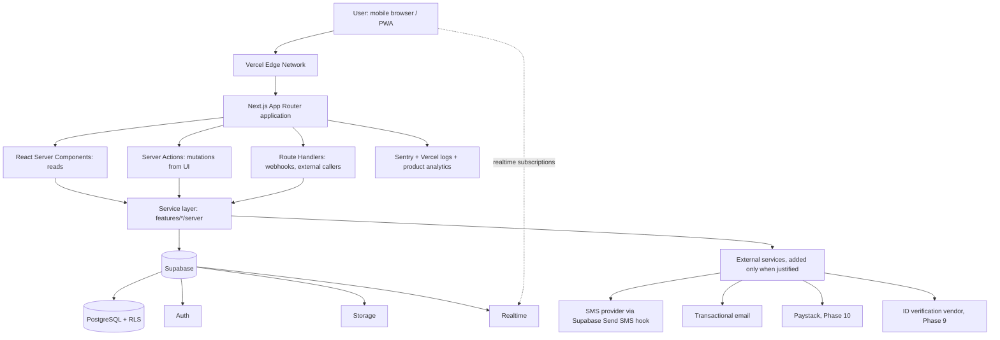
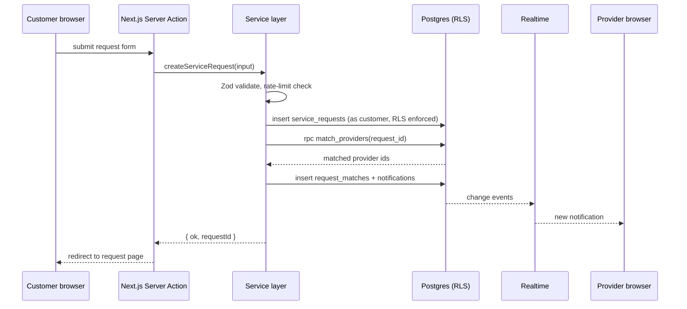
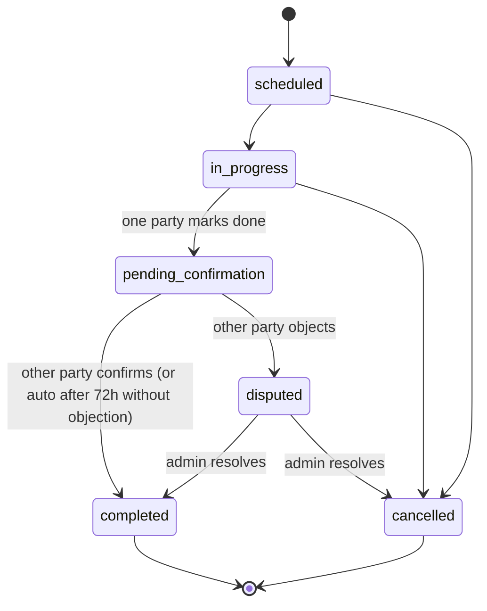
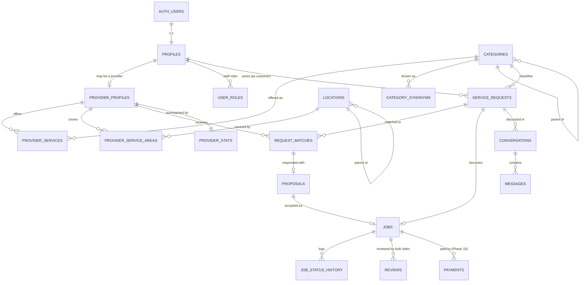
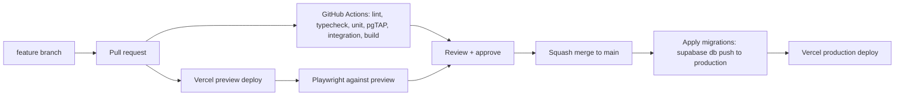

# Project DeyDo: Technical Product & Engineering Plan

| Field | Value |
|---|---|
| Working title | Project DeyDo (final name TBD) |
| Status | Pre-build |
| Document owner | Joshua (founder, engineering) |
| Last updated | 2026-10-04 |
| Companion document | [`product-vision.md`](./product-vision.md) |

> **Scope.** This document describes how DeyDo will be built from an empty repository to a production marketplace. Product scope, wedge and MVP rationale live in the product vision; this document only restates them where an engineering decision depends on them. Architecture decisions are recorded as **ADRs** inline and summarised in Section 2.4.

---

## 1. Technical Philosophy

| Principle | What it means here | What it rules out |
|---|---|---|
| **Simplicity first** | One deployable Next.js app plus one Supabase project. Postgres does as much as it reasonably can (constraints, RLS, functions, full-text search) before any new service is added | Microservices, message queues, separate API servers, Kubernetes, GraphQL layers in the MVP |
| **Type safety** | TypeScript strict mode end to end. Database types generated from the schema; runtime input validated with Zod at every trust boundary | `any`, hand-written DB types that drift, unvalidated `FormData` |
| **Security** | Authorization enforced in the database via Row Level Security, so a bug in application code cannot leak another user's data. Least privilege for every key | Relying only on UI checks; using the secret key in request paths that serve users |
| **Maintainability** | Feature-oriented code, small modules, explicit boundaries between UI, server logic and data access. Decisions written down | Clever abstractions, generic repository layers, premature "frameworks" |
| **Scalability** | Design so the obvious next scaling step is cheap (indexes, pagination, caching), but build only for the next order of magnitude | Sharding, read replicas, caching layers on day one |
| **Developer experience** | Local Supabase, reproducible migrations, generated types, one command to start, fast tests | Manual dashboard schema edits, "works on my machine" setup |
| **Production readiness** | Error tracking, audit logs, backups and CI from Phase 1, because a marketplace with real money and real people cannot be debugged by guesswork | Shipping to real users without monitoring or migrations under version control |

**Constraint that shapes everything:** Users are on mid-range Android phones with variable connectivity. Page weight, round trips and JavaScript bundle size are product requirements, not optimisations.

---

## 2. System Architecture

### 2.1 High-level view



### 2.2 Text diagram

```
User (mobile browser / installable PWA)
  │
  ▼
Next.js on Vercel (App Router, TypeScript)
  ├── Server Components ........ read data, render HTML
  ├── Server Actions ........... mutations from forms/UI
  ├── Route Handlers ........... webhooks (Paystack, SMS), cron, public API later
  └── features/*/server ........ service layer: business rules, validation
  │
  ▼
Supabase
  ├── PostgreSQL ............... schema, constraints, RLS, SQL functions, full-text search
  ├── Auth ..................... phone OTP, email, sessions (JWT)
  ├── Storage .................. avatars, portfolio, request photos, verification docs
  └── Realtime ................. chat messages, notifications
  │
  ▼
External (each justified, added in its phase)
  ├── SMS provider ............. OTP + critical alerts (Phase 2)
  ├── Email provider ........... transactional email (Phase 2)
  ├── Sentry ................... error tracking (Phase 1)
  ├── Product analytics ........ funnel metrics (Phase 1)
  ├── ID verification vendor ... NIN checks (Phase 9)
  └── Paystack ................. payments, payouts (Phase 10)
```

### 2.3 Request flow example: customer posts a request



### 2.4 Architecture Decision Records (summary)

| ADR | Decision | Status |
|---|---|---|
| ADR-001 | Single Next.js monolith on Vercel + Supabase; no separate backend | Accepted |
| ADR-002 | Authorization enforced via Postgres RLS; service layer still validates business rules | Accepted |
| ADR-003 | Server Actions for UI mutations; Route Handlers only for webhooks/external callers | Accepted |
| ADR-004 | Zod as the single validation library, shared by forms and server | Accepted |
| ADR-005 | Location as a seeded hierarchy (country > state > city > area); PostGIS deferred | Accepted |
| ADR-006 | Deterministic SQL matching in MVP; no ML | Accepted |
| ADR-007 | Payments off-platform in MVP; ledger-based design when added | Accepted |
| ADR-008 | Phone OTP as primary auth via Supabase Auth with a Send SMS hook | Proposed (validate SMS cost and delivery in Phase 0) |
| ADR-009 | Web app + PWA before native apps | Accepted |
| ADR-010 | pnpm, Node LTS, Vitest, Playwright, pgTAP | Accepted |

Each ADR is detailed where it applies below. New ADRs go in `docs/adr/NNN-title.md` using the template in Section 28.

---

## 3. Repository Structure

**[ADR-001]** One repository, one app. Feature folders group code by domain so a new engineer can find "everything about requests" in one place.

```
deydo/
├── app/                        # Next.js routes only: layouts, pages, route handlers
│   ├── (marketing)/            # public pages: landing, how it works, legal
│   ├── (auth)/                 # sign in, verify phone, onboarding
│   ├── (app)/                  # authenticated product
│   │   ├── requests/
│   │   ├── jobs/
│   │   ├── messages/
│   │   ├── provider/           # provider dashboard, profile editing
│   │   └── settings/
│   ├── admin/                  # admin console (role-gated)
│   ├── p/[handle]/             # public provider profile (shareable)
│   └── api/                    # route handlers: webhooks, cron
│       ├── webhooks/paystack/
│       └── cron/
├── features/                   # domain modules (the core of the codebase)
│   ├── auth/
│   ├── profiles/
│   ├── providers/
│   ├── catalog/                # categories, services, synonyms
│   ├── requests/
│   ├── matching/
│   ├── messaging/
│   ├── jobs/
│   ├── reviews/
│   ├── notifications/
│   ├── reports/
│   └── admin/
│       └── (each feature contains)
│           ├── components/     # UI specific to this feature
│           ├── server/         # service functions, queries, actions ("server-only")
│           ├── schemas.ts      # Zod schemas
│           └── types.ts        # feature-level types
├── components/                 # shared, domain-agnostic UI (buttons, inputs, layout)
│   └── ui/
├── lib/                        # shared infrastructure
│   ├── supabase/               # server, browser and admin client factories
│   ├── auth/                   # session helpers, role guards
│   ├── rate-limit.ts
│   ├── logger.ts
│   └── utils.ts
├── hooks/                      # shared client hooks (e.g., useRealtimeChannel)
├── types/
│   └── database.ts             # GENERATED from Supabase schema; never hand-edit
├── services/                   # adapters for third-party APIs (sms, email, paystack, kyc)
├── config/                     # env parsing (Zod), constants, feature flags
├── supabase/
│   ├── config.toml
│   ├── migrations/             # SQL migrations, timestamped, append-only
│   ├── seed.sql                # categories, locations, dev fixtures
│   └── tests/                  # pgTAP tests for RLS and SQL functions
├── tests/
│   ├── unit/                   # pure logic
│   ├── integration/            # service layer against local Supabase
│   └── e2e/                    # Playwright journeys
├── docs/
│   ├── product/
│   ├── adr/
│   └── runbooks/               # incident, migration, verification procedures
├── public/
└── .github/workflows/
```

| Folder | Why it exists | Rule |
|---|---|---|
| `app/` | Routing is the framework's job | Pages stay thin: fetch via `features/*/server`, render feature components |
| `features/` | Domain cohesion; makes boundaries visible | Features may import from `lib`, `components`, `services`, `config` and other features' **public** server functions, never their internals |
| `components/` | Reusable UI with no domain knowledge | No data fetching |
| `lib/` | Cross-cutting infrastructure | No domain logic |
| `hooks/` | Shared client-side hooks | Only if used by 2+ features; otherwise keep in the feature |
| `types/` | Generated DB types and global types | `database.ts` regenerated by script, checked in CI |
| `services/` | Isolate third-party APIs behind small interfaces so providers can be swapped and mocked | One file/folder per vendor; called only from `features/*/server` |
| `config/` | Typed, validated environment | App fails to boot on missing env vars |
| `supabase/` | Database as code | Every schema change is a migration |
| `tests/` | Test levels separated by cost | Unit tests may also sit next to code as `*.test.ts` |
| `docs/` | Decisions and runbooks travel with the code | |

**Deliberately absent:** `src/` (adds a level with no benefit here), `repositories/`, `controllers/`, `utils/` dumping grounds, a monorepo tool. Add Turborepo only if a second deployable (e.g., native app) appears.

---

## 4. Initial Project Setup

Run in order. Commands assume macOS/Linux; Windows users should use WSL2.

```bash
# 1. Toolchain
nvm install --lts && nvm use --lts      # Node LTS (see Section 5)
corepack enable                          # provides pnpm
pnpm --version

# 2. Create the app (App Router, TS, Tailwind, ESLint, no src/ dir)
pnpm create next-app@latest deydo \
  --typescript --tailwind --eslint --app \
  --no-src-dir --import-alias "@/*" --use-pnpm
cd deydo

# 3. Strict TypeScript: in tsconfig.json set
#    "strict": true, "noUncheckedIndexedAccess": true, "noImplicitOverride": true

# 4. Formatting
pnpm add -D prettier prettier-plugin-tailwindcss eslint-config-prettier
echo '{ "plugins": ["prettier-plugin-tailwindcss"] }' > .prettierrc

# 5. Core runtime dependencies
pnpm add @supabase/supabase-js @supabase/ssr zod server-only
# Forms (decide in Phase 1; plain <form> + Server Actions may suffice):
# pnpm add react-hook-form @hookform/resolvers

# 6. Testing
pnpm add -D vitest @vitejs/plugin-react @testing-library/react jsdom @playwright/test
pnpm exec playwright install --with-deps chromium

# 7. Supabase CLI (local stack requires Docker)
pnpm add -D supabase
pnpm exec supabase init
pnpm exec supabase start                 # prints local URL and keys

# 8. Git
git init && git add -A && git commit -m "chore: scaffold Next.js + Supabase"
gh repo create deydo --private --source=. --push

# 9. Link the hosted project (after creating it in the Supabase dashboard)
pnpm exec supabase link --project-ref <project-ref>
```

**Environment variables** (`.env.local`, never committed; `.env.example` committed with blank values):

```bash
NEXT_PUBLIC_SUPABASE_URL=
NEXT_PUBLIC_SUPABASE_PUBLISHABLE_KEY=   # replaces the legacy "anon" key
SUPABASE_SECRET_KEY=                    # replaces legacy "service_role"; server-only, never NEXT_PUBLIC_
NEXT_PUBLIC_APP_URL=http://localhost:3000
SENTRY_DSN=
NEXT_PUBLIC_ANALYTICS_KEY=
# Added in later phases:
# SMS_PROVIDER_API_KEY=  EMAIL_API_KEY=  PAYSTACK_SECRET_KEY=  KYC_API_KEY=  CRON_SECRET=
```

`config/env.ts` parses `process.env` with Zod and throws at startup if anything is missing or malformed. Server-only variables live in a module that imports `server-only`, so importing it from a client component fails the build.

> Verify the current names of Supabase keys and `create-next-app` flags against the docs at setup time; both have changed in recent releases.

---

## 5. Development Environment

| Item | Choice | Reason |
|---|---|---|
| Node | Current Active LTS, pinned in `.nvmrc` and `package.json#engines` | Matches Vercel runtime; predictable |
| Package manager | pnpm via Corepack, version pinned in `packageManager` field | Fast, strict dependency resolution, disk efficient |
| Editor | VS Code with ESLint, Prettier, Tailwind IntelliSense | |
| Database (local) | Supabase CLI local stack in Docker | Full Postgres, Auth, Storage, Realtime offline; disposable |
| OS | macOS, Linux or WSL2 | Supabase CLI and Docker parity |

### 5.1 Git conventions
- **Branches:** `main` (production) and short-lived `feat/…`, `fix/…`, `chore/…` branches. No long-lived `develop` branch (see Section 22).
- **Commits:** Conventional Commits (`feat(requests): add urgency field`). Enables readable history and changelogs.
- **PRs:** Small (aim for under 400 lines changed), linked to an issue, with a description of the user-visible change and any migration.

### 5.2 Local Supabase workflow

```bash
pnpm db:start                     # supabase start
pnpm exec supabase migration new add_service_requests   # creates timestamped SQL file
# write SQL in supabase/migrations/<timestamp>_add_service_requests.sql
pnpm db:reset                     # rebuild local DB from migrations + seed.sql
pnpm db:types                     # regenerate types/database.ts
pnpm db:test                      # run pgTAP tests in supabase/tests
```

**Rule:** Never change the hosted schema through the dashboard. If an emergency dashboard change happens, capture it immediately with `supabase db diff` into a migration.

### 5.3 Scripts (`package.json`)

```json
{
  "scripts": {
    "dev": "next dev",
    "build": "next build",
    "start": "next start",
    "lint": "eslint .",
    "format": "prettier --write .",
    "typecheck": "tsc --noEmit",
    "test": "vitest run",
    "test:watch": "vitest",
    "test:e2e": "playwright test",
    "db:start": "supabase start",
    "db:stop": "supabase stop",
    "db:reset": "supabase db reset",
    "db:types": "supabase gen types typescript --local > types/database.ts",
    "db:test": "supabase test db",
    "check": "pnpm lint && pnpm typecheck && pnpm test"
  }
}
```

---

## 6. Database Architecture

### 6.1 Design rules
- **UUID primary keys** (`gen_random_uuid()`), `created_at`/`updated_at` as `timestamptz` on every table, `updated_at` maintained by trigger.
- **Enums via Postgres `CHECK` constraints or enum types** for stable state sets (job status). Use lookup tables for anything admins edit (categories).
- **Money as integer minor units** (`amount_kobo bigint`) plus a `currency char(3)` column. Never floats. The currency column keeps international expansion open.
- **Soft-delete only where history matters** (users, providers). Jobs, reviews and payments are never deleted.
- **Every foreign key is indexed.** Every list query has a supporting index.
- **RLS enabled on every table in the `public` schema**, no exceptions.
- **Derived reputation stats are computed, not trusted from clients**, and cached in a stats table updated by triggers or scheduled functions.

### 6.2 Table inventory: MVP vs later

| Table | MVP? | Purpose |
|---|---|---|
| `auth.users` | Yes (managed by Supabase) | Identity and credentials. We never write to it directly |
| `profiles` | **Yes** | Public-facing person record, 1:1 with `auth.users` |
| `user_roles` | **Yes** | Admin and staff roles (customer/provider are capabilities, not exclusive roles) |
| `provider_profiles` | **Yes** | Provider-specific data: bio, verification level, availability, base location |
| `categories` | **Yes** | Hierarchical service taxonomy (e.g., Home Repair > AC Repair) |
| `category_synonyms` | **Yes** | Free-text terms (including Pidgin/local terms) mapped to categories |
| `provider_services` | **Yes** | Which categories a provider offers, with optional price guidance |
| `locations` | **Yes** | Seeded hierarchy: country > state > city > area |
| `provider_service_areas` | **Yes** | Areas a provider will travel to |
| `service_requests` | **Yes** | Customer's stated need |
| `request_attachments` | **Yes** | Photos attached to requests |
| `request_matches` | **Yes** | Which providers were shown a request, and their response state |
| `proposals` | **Yes** | Provider's response: interest, question or quote |
| `jobs` | **Yes** | The agreed engagement between one customer and one provider |
| `job_status_history` | **Yes** | Append-only audit of job state changes |
| `conversations` | **Yes** | Chat thread between a customer and a provider, scoped to a request |
| `conversation_participants` | **Yes** | Who is in a conversation; read state |
| `messages` | **Yes** | Chat messages |
| `reviews` | **Yes** | One review per side per completed job |
| `provider_stats` | **Yes** | Cached reputation metrics |
| `portfolio_items` | **Yes** | Provider work samples |
| `notifications` | **Yes** | In-app notifications; source for push/SMS/email fan-out |
| `reports` | **Yes** | User-submitted reports of users, messages, requests or jobs |
| `verification_records` | **Yes (manual)** | Evidence and outcome of each verification check |
| `audit_logs` | **Yes** | Admin and sensitive actions |
| `skills` | No, later | Fine-grained skills beyond categories. Categories suffice for the wedge; adding both now creates two overlapping taxonomies |
| `services` (as separate table) | No | Merged into `categories` (leaf nodes are services). Revisit if packaged fixed-price services are added |
| `disputes` | Later (Phase 9/10) | Structured dispute workflow. MVP uses `reports` with `type = 'job_problem'` |
| `payments`, `payouts`, `ledger_entries` | Later (Phase 10) | Payment architecture (Section 14) |
| `users` (custom) | **Never** | Duplicates `auth.users`; use `profiles` |

### 6.3 Core table definitions (MVP)

The SQL below is the intended shape; final migrations may differ in detail.

#### `profiles`
- **Purpose:** One row per authenticated person; holds display data shared by customer and provider modes.
- **Relationships:** `id` = `auth.users.id` (1:1).

```sql
create table public.profiles (
  id uuid primary key references auth.users(id) on delete cascade,
  full_name text not null check (char_length(full_name) between 2 and 100),
  handle citext unique check (handle ~ '^[a-z0-9_]{3,30}$'),   -- for /p/[handle]
  avatar_path text,                                           -- storage path, not URL
  phone_verified boolean not null default false,
  default_location_id uuid references public.locations(id),
  status text not null default 'active'
    check (status in ('active','suspended','deleted')),
  created_at timestamptz not null default now(),
  updated_at timestamptz not null default now()
);
create index on public.profiles (default_location_id);
```
Phone numbers stay in `auth.users`; they are not copied to `profiles` so that RLS on public profile reads cannot leak them.

#### `user_roles`
```sql
create table public.user_roles (
  user_id uuid not null references public.profiles(id) on delete cascade,
  role text not null check (role in ('admin','support')),
  granted_by uuid references public.profiles(id),
  created_at timestamptz not null default now(),
  primary key (user_id, role)
);
```
Customer is the default capability of every profile; provider capability is the existence of a `provider_profiles` row.

#### `provider_profiles`
```sql
create table public.provider_profiles (
  id uuid primary key references public.profiles(id) on delete cascade,
  headline text check (char_length(headline) <= 120),
  bio text check (char_length(bio) <= 2000),
  base_location_id uuid not null references public.locations(id),
  work_modes text[] not null default '{onsite}'
    check (work_modes <@ array['onsite','remote','hybrid']),
  is_available boolean not null default true,
  verification_level smallint not null default 0,  -- 0 none, 1 phone, 2 ID, 3 in-person
  status text not null default 'pending'
    check (status in ('pending','approved','rejected','suspended')),
  approved_at timestamptz,
  created_at timestamptz not null default now(),
  updated_at timestamptz not null default now()
);
create index on public.provider_profiles (base_location_id) where status = 'approved';
create index on public.provider_profiles (status);
```
`verification_level` and `status` are writable only by admins (enforced by RLS plus a column-guard trigger).

#### `categories` and `category_synonyms`
```sql
create table public.categories (
  id uuid primary key default gen_random_uuid(),
  parent_id uuid references public.categories(id),
  slug citext unique not null,
  name text not null,
  default_mode text not null default 'onsite'
    check (default_mode in ('onsite','remote','hybrid')),
  required_fields jsonb not null default '[]',  -- e.g. [{"key":"ac_type","label":"AC type","options":[...]}]
  is_active boolean not null default true,
  sort_order int not null default 0
);
create index on public.categories (parent_id);

create table public.category_synonyms (
  id uuid primary key default gen_random_uuid(),
  category_id uuid not null references public.categories(id) on delete cascade,
  term citext not null,
  language text not null default 'en',          -- 'en', 'pcm' (Pidgin), 'ha', 'yo', 'ig'
  unique (category_id, term)
);
create index category_synonyms_trgm on public.category_synonyms using gin (term gin_trgm_ops);
```
Only leaf categories can be attached to requests and provider services (enforced in the service layer and a check function).

#### `locations`
See Section 12. Seeded table: `id, parent_id, type ('country'|'state'|'city'|'area'), name, slug, country_code, lat, lng`.

#### `provider_services` and `provider_service_areas`
```sql
create table public.provider_services (
  provider_id uuid not null references public.provider_profiles(id) on delete cascade,
  category_id uuid not null references public.categories(id),
  min_price_kobo bigint check (min_price_kobo >= 0),
  currency char(3) not null default 'NGN',
  primary key (provider_id, category_id)
);
create index on public.provider_services (category_id);

create table public.provider_service_areas (
  provider_id uuid not null references public.provider_profiles(id) on delete cascade,
  location_id uuid not null references public.locations(id),
  primary key (provider_id, location_id)
);
create index on public.provider_service_areas (location_id);
```

#### `service_requests`
```sql
create table public.service_requests (
  id uuid primary key default gen_random_uuid(),
  customer_id uuid not null references public.profiles(id),
  raw_text text not null check (char_length(raw_text) between 5 and 2000),
  category_id uuid not null references public.categories(id),
  mode text not null check (mode in ('onsite','remote','hybrid')),
  location_id uuid references public.locations(id),        -- required when mode <> 'remote'
  address_detail text,                                      -- revealed only to selected provider
  urgency text not null check (urgency in ('asap','today','scheduled','flexible')),
  preferred_date date,
  budget_min_kobo bigint, budget_max_kobo bigint,
  currency char(3) not null default 'NGN',
  details jsonb not null default '{}',                      -- answers to category.required_fields
  status text not null default 'open'
    check (status in ('open','matched','in_job','closed','expired','cancelled')),
  expires_at timestamptz not null default now() + interval '7 days',
  search tsvector generated always as (to_tsvector('english', raw_text)) stored,
  created_at timestamptz not null default now(),
  updated_at timestamptz not null default now(),
  constraint location_required check (mode = 'remote' or location_id is not null),
  constraint budget_order check (budget_max_kobo is null or budget_min_kobo is null
                                 or budget_max_kobo >= budget_min_kobo)
);
create index on public.service_requests (customer_id, created_at desc);
create index on public.service_requests (category_id, location_id) where status = 'open';
create index on public.service_requests using gin (search);
```

#### `request_matches`
- **Purpose:** Records that a request was shown to a provider, so we can measure match rate and response rate, and so providers only see requests matched to them.

```sql
create table public.request_matches (
  request_id uuid not null references public.service_requests(id) on delete cascade,
  provider_id uuid not null references public.provider_profiles(id),
  score numeric(6,3) not null,
  source text not null default 'auto' check (source in ('auto','admin')),
  state text not null default 'notified'
    check (state in ('notified','viewed','responded','declined','expired')),
  notified_at timestamptz not null default now(),
  responded_at timestamptz,
  primary key (request_id, provider_id)
);
create index on public.request_matches (provider_id, state, notified_at desc);
```

#### `proposals`
```sql
create table public.proposals (
  id uuid primary key default gen_random_uuid(),
  request_id uuid not null references public.service_requests(id) on delete cascade,
  provider_id uuid not null references public.provider_profiles(id),
  kind text not null check (kind in ('interest','question','quote')),
  message text check (char_length(message) <= 1000),
  quote_kobo bigint check (quote_kobo > 0),
  currency char(3) not null default 'NGN',
  status text not null default 'active'
    check (status in ('active','withdrawn','accepted','rejected')),
  created_at timestamptz not null default now(),
  unique (request_id, provider_id),
  constraint quote_needs_amount check (kind <> 'quote' or quote_kobo is not null),
  constraint must_be_matched foreign key (request_id, provider_id)
    references public.request_matches(request_id, provider_id)
);
create index on public.proposals (provider_id, created_at desc);
```
The composite foreign key guarantees a provider can only propose on a request they were matched to.

#### `jobs` and `job_status_history`
```sql
create table public.jobs (
  id uuid primary key default gen_random_uuid(),
  request_id uuid not null unique references public.service_requests(id),  -- MVP: one job per request
  proposal_id uuid references public.proposals(id),
  customer_id uuid not null references public.profiles(id),
  provider_id uuid not null references public.provider_profiles(id),
  agreed_price_kobo bigint check (agreed_price_kobo >= 0),
  currency char(3) not null default 'NGN',
  scheduled_for timestamptz,
  status text not null default 'scheduled'
    check (status in ('scheduled','in_progress','pending_confirmation',
                      'completed','cancelled','disputed')),
  customer_confirmed_at timestamptz,
  provider_confirmed_at timestamptz,
  completed_at timestamptz,
  cancelled_by uuid references public.profiles(id),
  cancellation_reason text,
  payment_method text not null default 'offline' check (payment_method in ('offline','platform')),
  created_at timestamptz not null default now(),
  updated_at timestamptz not null default now(),
  constraint different_parties check (customer_id <> provider_id)
);
create index on public.jobs (customer_id, created_at desc);
create index on public.jobs (provider_id, status);

create table public.job_status_history (
  id bigint generated always as identity primary key,
  job_id uuid not null references public.jobs(id) on delete cascade,
  from_status text, to_status text not null,
  changed_by uuid references public.profiles(id),
  note text,
  created_at timestamptz not null default now()
);
create index on public.job_status_history (job_id, created_at);
```
**Job state machine** (enforced in a `transition_job(job_id, to_status)` SQL function, not by direct updates):



#### `conversations`, `conversation_participants`, `messages`
See Section 13.

#### `reviews` and `provider_stats`
See Section 15.

#### `notifications`, `reports`, `verification_records`, `audit_logs`, `portfolio_items`
Defined in Sections 16, 17 and 18. `portfolio_items`: `id, provider_id, storage_path, caption, category_id, job_id (nullable, set when linked to a platform job), created_at`.

### 6.4 Extensions
`pgcrypto` (UUIDs), `citext` (case-insensitive handles/terms), `pg_trgm` (fuzzy synonym matching). `postgis` deferred (Section 12). `pg_cron` for scheduled jobs (request expiry, auto-confirmation, stats refresh) when needed.

---

## 7. Database Relationships



| Relationship | Cardinality | Notes |
|---|---|---|
| User → Profile | 1:1 | Profile created by trigger on `auth.users` insert |
| Profile → Provider profile | 1:0..1 | A person can be both customer and provider |
| Provider → Skills (categories) | M:N via `provider_services` | Leaf categories only |
| Customer → Request | 1:N | |
| Request → Matches | 1:N | One row per provider shown the request |
| Provider → Proposal | 1:N, max one per request | Composite FK to `request_matches` |
| Request → Job | 1:0..1 in MVP | Relax to 1:N later for multi-provider jobs |
| Job → Payment | 1:N (Phase 10) | Supports partial payments, refunds |
| Job → Review | 1:0..2 | One per side, unique (job_id, reviewer_id) |

---

## 8. Authentication & Authorization

### 8.1 Authentication [ADR-008]

| Method | Who | Phase | Notes |
|---|---|---|---|
| Phone OTP | Everyone (primary) | Phase 2 | Matches how Nigerians identify online; required for providers. Supabase Auth phone login, with SMS delivered through a **Send SMS Auth Hook** to the chosen SMS provider |
| Email magic link / password | Customers and professionals who prefer email | Phase 2 | Fallback when SMS delivery fails |
| Google OAuth | Optional for customers | Later | Low effort, but not core in the wedge |

**Trade-off:** Phone OTP costs money per message and SMS delivery in Nigeria can be affected by operator routing and DND settings. **Decision:** phone OTP is primary but we measure OTP delivery success and cost during Phase 0/2. If delivery is unreliable, fall back to email/password for customers and keep phone verification as a provider trust step only. WhatsApp OTP is a later option.

Session handling uses `@supabase/ssr` with cookie-based sessions. The Next.js request interceptor (`proxy.ts` in current Next.js, `middleware.ts` in older versions) refreshes the session token; it does **not** perform authorization.

### 8.2 Roles and capabilities

| Capability | How determined | Can do |
|---|---|---|
| Customer | Any active profile | Post requests, chat with matched providers, accept proposals, confirm jobs, review |
| Provider | `provider_profiles` row with `status = 'approved'` | See matched requests, propose, chat, run jobs, review customers |
| Pending provider | `provider_profiles.status = 'pending'` | Edit own profile; cannot see requests |
| Support | `user_roles.role = 'support'` | Read user data for support, handle reports; cannot change roles |
| Admin | `user_roles.role = 'admin'` | Everything support can do plus verification, suspension, categories, roles |

Staff roles are embedded in the JWT via a **Custom Access Token Auth Hook** so RLS policies can read them without a join on every query; the hook reads from `user_roles`. Role changes take effect on next token refresh, so suspensions also set `profiles.status = 'suspended'`, which policies check directly.

### 8.3 Row Level Security [ADR-002]

RLS makes Postgres enforce "who can see/change which rows" for every query made with a user's token, regardless of which code path made it. Policies are written per table and per operation.

**Helper functions** (`security definer`, `stable`, fixed `search_path`):

```sql
create function public.is_admin() returns boolean
language sql stable security definer set search_path = '' as $$
  select coalesce((auth.jwt() ->> 'staff_role') = 'admin', false)  -- claim set by the access token hook
$$;

create function public.is_active_user() returns boolean
language sql stable security definer set search_path = '' as $$
  select exists (select 1 from public.profiles
                 where id = auth.uid() and status = 'active')
$$;
```

**Example policies:**

```sql
alter table public.service_requests enable row level security;

-- Customers see their own requests
create policy "customer reads own requests" on public.service_requests
  for select using (customer_id = auth.uid());

-- Providers see only requests they were matched to
create policy "provider reads matched requests" on public.service_requests
  for select using (exists (
    select 1 from public.request_matches m
    where m.request_id = service_requests.id and m.provider_id = auth.uid()));

-- Only active users create requests, only for themselves
create policy "customer creates own request" on public.service_requests
  for insert with check (customer_id = auth.uid() and public.is_active_user());

create policy "admin reads all requests" on public.service_requests
  for select using (public.is_admin());
```

`address_detail` must not be visible to matched-but-unselected providers. Because RLS is row-level, not column-level, providers read requests through a **view** (`provider_request_view`, `security_invoker = true`) that omits `address_detail` unless a job exists between them.

### 8.4 Security principles that must hold
1. RLS enabled on every `public` table; CI fails if a table lacks it (pgTAP test).
2. The secret key is used only in route handlers for webhooks/cron and in admin-only server code, never in code paths serving ordinary user requests.
3. State transitions with business rules (accept proposal, transition job, submit review) run through SQL functions or service functions that validate preconditions, not ad hoc updates.
4. Users can never write their own `status`, `verification_level`, roles or reputation stats.
5. Contact details (phone, exact address) are revealed only after a job is created between the two parties.
6. Every admin action is written to `audit_logs`.

---

## 9. API / Server Architecture

### 9.1 Mechanisms and when to use each [ADR-003]

| Mechanism | Use for | Do not use for |
|---|---|---|
| **React Server Components** | Reading data for pages (request list, profile, job detail) | Mutations |
| **Server Actions** | Mutations triggered by our own UI (create request, send proposal, accept, confirm, review) | Webhooks, third-party callers, anything needing a stable public URL |
| **Route Handlers** (`app/api/**/route.ts`) | Paystack/SMS webhooks, cron endpoints, file upload signing if needed, a future public/mobile API | UI mutations that a Server Action can do |
| **Supabase client in the browser** | Realtime subscriptions (chat, notifications); direct uploads to Storage using signed upload URLs | General data writes (keep writes server-side so validation and rate limits run) |
| **SQL functions (RPC)** | Multi-step operations that must be atomic (accept proposal → create job → update request → notify), matching queries | Simple CRUD |

### 9.2 Layering

```
UI component  →  Server Action (thin: auth, parse, call service, revalidate)
                      ↓
               features/<x>/server/<x>.service.ts   (business rules, Zod validation)
                      ↓
               Supabase client with the user's session (RLS applies)
               or RPC for atomic operations
```

**Example: accept a proposal**

```ts
// features/jobs/server/actions.ts
'use server'
export async function acceptProposalAction(input: unknown) {
  const user = await requireUser()                       // lib/auth
  const { proposalId } = AcceptProposalSchema.parse(input)
  const result = await jobsService.acceptProposal(user.id, proposalId)
  revalidatePath(`/requests/${result.requestId}`)
  return result
}

// features/jobs/server/jobs.service.ts
import 'server-only'
export async function acceptProposal(userId: string, proposalId: string) {
  const supabase = await createServerClient()            // user-scoped, RLS on
  const { data, error } = await supabase.rpc('accept_proposal', { p_proposal_id: proposalId })
  if (error) throw mapDbError(error)                    // translate to domain errors
  await notificationsService.jobCreated(data.job_id)
  return data
}
```

`accept_proposal` checks inside one transaction that the caller owns the request, the request is open, the proposal is active, then creates the job, marks other proposals rejected and updates the request status.

**Error handling:** Services throw typed domain errors (`NotFound`, `Forbidden`, `Conflict`, `ValidationError`, `RateLimited`). Actions convert them into a `{ ok: false, error: { code, message, fieldErrors? } }` result for forms. Unexpected errors go to Sentry with a request ID; users see a generic message.

---

## 10. Validation [ADR-004]

| Layer | Tool | Purpose |
|---|---|---|
| Form (client) | Zod schema via the same module as the server; HTML attributes (`required`, `maxLength`) | Fast feedback; reduce bad submissions on slow networks |
| Server Action / Route Handler input | Zod `parse` on every input, including `FormData` and webhook bodies | Trust boundary; never trust the client |
| Service layer | Business rules (e.g., "request must be open", "provider must be approved") | Rules that need data |
| Database | `NOT NULL`, `CHECK`, `UNIQUE`, foreign keys, RLS, SQL function preconditions | Final guarantee; protects against bugs and direct API access |
| External API responses | Zod parse of Paystack/KYC responses | Don't trust third-party shapes |
| Environment | Zod in `config/env.ts` | Fail fast on misconfiguration |

```ts
// features/requests/schemas.ts
export const CreateRequestSchema = z.object({
  rawText: z.string().trim().min(5).max(2000),
  categoryId: z.string().uuid(),
  mode: z.enum(['onsite', 'remote', 'hybrid']),
  locationId: z.string().uuid().optional(),
  urgency: z.enum(['asap', 'today', 'scheduled', 'flexible']),
  preferredDate: z.coerce.date().optional(),
  budgetMinKobo: z.number().int().nonnegative().optional(),
  budgetMaxKobo: z.number().int().nonnegative().optional(),
  details: z.record(z.string(), z.unknown()).default({}),
}).refine(v => v.mode === 'remote' || v.locationId, {
  path: ['locationId'], message: 'Location is required for on-site work',
})
```

Category `required_fields` are validated dynamically by building a Zod schema from the category definition on the server.

**Rule:** The database constraint and the Zod schema must agree. When they diverge, the database wins and a test should catch it.

---

## 11. Search & Matching [ADR-006]

### 11.1 Step 1: free text to category

1. Normalise text (lowercase, strip punctuation).
2. Match tokens and phrases against `category_synonyms` using exact and trigram similarity.
3. Return top 3 candidate leaf categories with scores.
4. Customer confirms or picks another category. The confirmed choice is stored alongside `raw_text`, building a labelled dataset for later.

Example synonym rows: `ac`, `air conditioner`, `aircon`, `ac no dey cool` → AC Repair; `gen`, `generator`, `gen no gree start` → Generator Repair; `inverter`, `solar` → Inverter & Solar.

### 11.2 Step 2: candidate providers (hard filters)

A provider is a candidate only if **all** are true:
- `provider_profiles.status = 'approved'` and profile `status = 'active'`
- Offers the request's category (`provider_services`)
- `is_available = true`
- Mode compatible (`request.mode` in `work_modes`, or provider supports `hybrid`)
- For on-site: the request's area, or its parent city, is in `provider_service_areas`
- Not already matched to this request; not blocked by or blocking the customer

### 11.3 Step 3: score and cap

| Signal | Weight (initial) | Notes |
|---|---|---|
| Exact area match (vs city-level) | 0.25 | Closer is better for on-site |
| Verification level | 0.20 | 0 to 3, normalised |
| Bayesian average rating | 0.20 | Prior of 4.0 with weight 5 to avoid one 5-star review dominating |
| Response rate (last 90 days) | 0.15 | Rewards responsiveness |
| Completion rate | 0.10 | Penalises cancellations |
| Budget fit | 0.05 | Provider `min_price_kobo` ≤ budget max |
| New provider boost | 0.05 | Applied for first N jobs to avoid supply ossification |

Top **K** (start with 8, configurable) providers are notified. If fewer than 3 respond within the urgency window (e.g., 1 hour for `asap`, 12 hours for `flexible`), a scheduled job widens to the next K, and the ops team is alerted for manual matching.

```sql
create function public.match_providers(p_request_id uuid, p_limit int default 8)
returns table (provider_id uuid, score numeric)
language sql stable security definer set search_path = '' as $$
  with r as (select * from public.service_requests where id = p_request_id),
  candidates as (
    select pp.id,
           case when exists (select 1 from public.provider_service_areas a
                             where a.provider_id = pp.id and a.location_id = r.location_id)
                then 1 else 0.5 end                              as area_score,
           pp.verification_level / 3.0                           as verif_score,
           coalesce(ps.bayes_rating, 4.0) / 5.0                  as rating_score,
           coalesce(ps.response_rate_90d, 0.5)                   as response_score,
           coalesce(ps.completion_rate, 0.8)                     as completion_score,
           case when coalesce(ps.completed_jobs, 0) < 3 then 1 else 0 end as new_boost
    from r
    join public.provider_services s on s.category_id = r.category_id
    join public.provider_profiles pp on pp.id = s.provider_id
    left join public.provider_stats ps on ps.provider_id = pp.id
    where pp.status = 'approved' and pp.is_available
      and pp.id <> r.customer_id
      and (r.mode = 'remote' or exists (
            select 1 from public.provider_service_areas a
            join public.locations l on l.id = r.location_id
            where a.provider_id = pp.id and a.location_id in (l.id, l.parent_id)))
      and not exists (select 1 from public.request_matches m
                      where m.request_id = r.id and m.provider_id = pp.id)
  )
  select id, round((0.25*area_score + 0.20*verif_score + 0.20*rating_score
                  + 0.15*response_score + 0.10*completion_score + 0.05*new_boost)::numeric, 3)
  from candidates order by 2 desc, random() limit p_limit;
$$;
```

Weights live in a config table so they can be tuned without a deploy. Matching outcomes (who was notified, who responded, who was chosen, how the job ended) are logged so later models have ground truth.

### 11.4 Provider-side discovery
Providers see requests matched to them. Customers can also browse providers by category and area (public directory) using the same filters, sorted by the same score without the request-specific signals.

### 11.5 Evolution

| Stage | Trigger to move on | Approach |
|---|---|---|
| v1 (MVP) | n/a | Rules above + manual ops matching |
| v2 | A few thousand completed jobs | Tune weights using observed outcomes; add response-time, repeat-customer signals |
| v3 | Clear evidence rules are the bottleneck | LLM-assisted request parsing into the same schema; learning-to-rank model trained on match → response → completion outcomes, A/B tested against v2 |
| v4 | Multi-city scale | Real-time availability, travel-time estimates (PostGIS + routing), demand forecasting for ops |

Do not build v3 before v1 has produced labelled outcomes. A model without data is a random number generator with extra cost.

---

## 12. Location Architecture [ADR-005]

### 12.1 Model

```sql
create table public.locations (
  id uuid primary key default gen_random_uuid(),
  parent_id uuid references public.locations(id),
  type text not null check (type in ('country','state','city','area')),
  name text not null,
  slug citext not null,
  country_code char(2) not null,         -- 'NG'; supports later expansion
  lat double precision, lng double precision,
  is_active boolean not null default true,
  unique (parent_id, slug)
);
create index on public.locations (parent_id);
create index on public.locations (type, country_code) where is_active;
```

- **Country → State → City/LGA → Area/neighbourhood.** Nigeria's 36 states and FCT are seeded fully; cities and areas are seeded only for the wedge city, curated by the ops team (official LGA boundaries often don't match how people describe locations, e.g., estate or market names).
- Users pick from the list; free-text address detail is stored on the request and revealed only to the selected provider.

### 12.2 MVP vs later

| Capability | MVP | Later |
|---|---|---|
| Country/state/city/area hierarchy | Yes | |
| Provider service areas as a list of areas | Yes | |
| Coordinates on areas (centroid) | Yes, optional | Used for map display |
| User GPS location | No | Optional "use my location" to pre-select area |
| Radius search ("within 5 km") | No | When a city has enough providers that area lists become too coarse. Add `postgis`, store `geography(Point)` on providers and requests, query with `ST_DWithin` and a GiST index |
| Travel time / routing | No | Phase 12 if ops data shows it matters |

**Why not PostGIS now:** Areas are how people in the wedge describe where they are, providers think in areas, and precise coordinates create privacy risk. Area lists are simpler, private by default and sufficient for one city. PostGIS is available in Supabase when needed, and the migration path is additive.

---

## 13. Messaging

### 13.1 Model

```sql
create table public.conversations (
  id uuid primary key default gen_random_uuid(),
  request_id uuid not null references public.service_requests(id),
  customer_id uuid not null references public.profiles(id),
  provider_id uuid not null references public.provider_profiles(id),
  status text not null default 'open' check (status in ('open','closed','locked')),
  last_message_at timestamptz,
  created_at timestamptz not null default now(),
  unique (request_id, provider_id)
);
create index on public.conversations (customer_id, last_message_at desc);
create index on public.conversations (provider_id, last_message_at desc);

create table public.conversation_participants (
  conversation_id uuid references public.conversations(id) on delete cascade,
  user_id uuid references public.profiles(id),
  last_read_at timestamptz,
  muted boolean not null default false,
  primary key (conversation_id, user_id)
);

create table public.messages (
  id uuid primary key default gen_random_uuid(),
  conversation_id uuid not null references public.conversations(id) on delete cascade,
  sender_id uuid not null references public.profiles(id),
  kind text not null default 'text' check (kind in ('text','image','system')),
  body text check (char_length(body) <= 4000),
  attachment_path text,
  flagged boolean not null default false,
  created_at timestamptz not null default now()
);
create index on public.messages (conversation_id, created_at desc);
```

- **Who can start a conversation:** A conversation opens when a matched provider responds to a request (or the customer messages a matched provider). Strangers cannot message each other. This single rule removes most spam.
- **Read state:** `last_read_at` per participant; unread count = messages newer than it.
- **Realtime:** Clients subscribe to Supabase Realtime Postgres Changes on `messages` filtered by `conversation_id`; RLS ensures only participants receive rows. If message volume grows, switch to Realtime Broadcast channels with authorization, which scale better than Postgres Changes.
- **Offline/slow networks:** Optimistic UI with a pending state; messages sent via Server Action; history paginated by `created_at` cursor.
- **Notifications:** New message creates an in-app notification only if the recipient isn't actively viewing the conversation; external channels (SMS/WhatsApp/email) are batched to avoid spamming.

### 13.2 Abuse prevention and privacy
- Phone numbers and exact addresses hidden until a job exists. Before that, a lightweight filter flags phone numbers, bank details and payment links in messages and shows a safety notice ("Never pay before agreeing on DeyDo"). We do not block contact sharing outright in the MVP: blocking pushes users off-platform anyway and we need data on how often it happens.
- Rate limit messages per user per minute; limit new conversations per provider per day.
- Report and block from any conversation; blocked users cannot message or be matched.
- Image messages go through the same file validation as uploads (Section 18).
- Admin can read a conversation only when it is the subject of a report or dispute, and every such access is audit-logged. This is stated in the privacy policy.
- Messages are retained for a defined period after the job closes (to support disputes) and then deleted or anonymised, consistent with the data minimisation obligations of the Nigeria Data Protection Act.

---

## 14. Payments [ADR-007]

### 14.1 MVP: no in-platform payments
The job stores `agreed_price_kobo` and `payment_method = 'offline'`. Customers pay providers directly. This lets us measure GMV (self-reported) and observe payment disputes before building money movement.

### 14.2 Future architecture (Phase 10)

**Provider:** Paystack first (Flutterwave as a fallback adapter behind the same `services/payments` interface). Paystack's local pricing is 1.5% + ₦100, with the ₦100 waived under ₦2,500 and capped at ₦2,000 per transaction ([Paystack](https://support.paystack.com/hc/en-us/articles/360009881920)). Paystack supports split payments via subaccounts ([docs](https://paystack.com/docs/payments/split-payments)) and transfers for payouts.

**Two possible models:**

| Model | How | Pros | Cons |
|---|---|---|---|
| A. Split at payment | Provider has a Paystack subaccount; each charge splits platform fee automatically | Platform never holds provider money; simplest compliance | No protection window; refunds after settlement are harder |
| B. Collect, hold, pay out | Platform collects, records liability, pays provider via transfer after completion | Real payment protection; enables disputes | Holding customer funds may have regulatory implications; needs legal advice and possibly a licensed partner; more reconciliation work |

**Decision:** Start with **Model A** for selected categories and get legal advice before implementing Model B. Escrow-like holding is a regulatory question first and an engineering question second.

**Data model (ledger-based, either model):**

```
payments        (id, job_id, payer_id, amount_kobo, currency, provider='paystack',
                 provider_reference UNIQUE, status, created_at)
payouts         (id, provider_id, amount_kobo, currency, provider_reference UNIQUE, status)
ledger_entries  (id, txn_id, account, direction ('debit'|'credit'), amount_kobo, currency,
                 job_id, created_at)   -- append-only; every money event is balanced
refunds         (id, payment_id, amount_kobo, reason, status, provider_reference UNIQUE)
```

**Payment status machine:** `initiated → pending → succeeded | failed | abandoned`; `succeeded → refunded | partially_refunded | disputed`.

**Rules:**
- Payment status changes only from **verified webhooks** (Paystack signature checked with HMAC-SHA512 over the raw body) or server-side verification calls, never from the client redirect.
- Webhook handler is **idempotent**: unique `provider_reference`, processed-events table, safe on retries.
- Platform fee computed server-side from a versioned fee config and stored on the payment row.
- Nightly reconciliation job compares Paystack settlements with the ledger and alerts on mismatches.
- Refunds and dispute outcomes produce compensating ledger entries; nothing is updated in place.
- No wallets or stored balances until there is a clear product and regulatory case.

---

## 15. Reviews & Reputation

```sql
create table public.reviews (
  id uuid primary key default gen_random_uuid(),
  job_id uuid not null references public.jobs(id),
  reviewer_id uuid not null references public.profiles(id),
  reviewee_id uuid not null references public.profiles(id),
  role text not null check (role in ('customer_to_provider','provider_to_customer')),
  rating smallint not null check (rating between 1 and 5),
  body text check (char_length(body) <= 1000),
  is_visible boolean not null default false,      -- blind until both submit or window closes
  hidden_by_admin boolean not null default false,
  created_at timestamptz not null default now(),
  unique (job_id, reviewer_id),
  constraint not_self check (reviewer_id <> reviewee_id)
);
create index on public.reviews (reviewee_id, created_at desc) where is_visible and not hidden_by_admin;

create table public.provider_stats (
  provider_id uuid primary key references public.provider_profiles(id) on delete cascade,
  completed_jobs int not null default 0,
  rating_count int not null default 0,
  rating_avg numeric(3,2),
  bayes_rating numeric(3,2),
  response_rate_90d numeric(4,3),
  median_response_minutes int,
  completion_rate numeric(4,3),
  repeat_customers int not null default 0,
  updated_at timestamptz not null default now()
);
```

**How completed jobs generate reputation:**
1. Job reaches `completed` → both parties are prompted to review (in-app, then a reminder).
2. `submit_review` SQL function checks: job is completed (or admin-resolved), caller is a party to it, within the review window (e.g., 14 days), no existing review by caller.
3. When both reviews exist, or the window closes, both become visible.
4. A trigger or scheduled function recomputes `provider_stats`.

**Abuse prevention:**

| Abuse | Control |
|---|---|
| Fake reviews | Reviews require a completed job; jobs require a request, a match and an accepted proposal |
| Self-reviews | `reviewer_id <> reviewee_id` constraint; `customer_id <> provider_id` on jobs; flag accounts sharing phone, device or payment details (later) |
| Collusion (friends posting fake jobs) | Flag patterns: same pair repeatedly, jobs completed minutes after creation, new accounts reviewing only one provider. Weight reviews by reviewer history. Admin review queue |
| Retaliation | Blind reviews; provider can respond publicly once; admin can hide reviews that violate policy (logged) |
| Rating inflation | Bayesian average with a prior; show distribution and count, not just the mean |
| Review extortion ("give me 5 stars or…") | Report flow; policy-based removal; pattern detection on reports |

---

## 16. Notifications

### 16.1 Architecture
One `notifications` table is the source of truth. A service function writes the row; delivery to external channels is fanned out from there based on user preferences and channel availability.

```sql
create table public.notifications (
  id uuid primary key default gen_random_uuid(),
  user_id uuid not null references public.profiles(id) on delete cascade,
  type text not null,                 -- e.g. 'request.matched'
  payload jsonb not null default '{}',
  read_at timestamptz,
  created_at timestamptz not null default now()
);
create index on public.notifications (user_id, created_at desc);
create index on public.notifications (user_id) where read_at is null;
```

| Channel | Phase | Notes |
|---|---|---|
| In-app (Realtime) | MVP | Badge + list |
| Web push (PWA) | MVP if feasible | Works on Android Chrome; free |
| Email | MVP | Transactional email provider; important for customers and professionals |
| SMS | Phase 2 for critical events only | Costs money; reserve for "new matching request" to providers and job reminders |
| WhatsApp (Business Platform) | Post-MVP | Likely the most effective channel for artisans; requires approved templates and per-conversation costs |

### 16.2 Events

| Event | Recipient | Channels (MVP) |
|---|---|---|
| `request.matched` | Provider | In-app, push, SMS (critical) |
| `proposal.received` | Customer | In-app, push, email |
| `message.received` | Either | In-app, push (batched) |
| `proposal.accepted` / `job.created` | Provider | In-app, push, SMS |
| `job.reminder` (scheduled time approaching) | Both | In-app, push |
| `job.marked_done` | Other party | In-app, push |
| `job.completed` → review prompt | Both | In-app, email |
| `request.no_responses` | Customer + ops | In-app; ops alert |
| `provider.approved` / `rejected` | Provider | In-app, SMS |
| `account.suspended` | User | Email/SMS |
| `report.received` | Ops | Admin dashboard |

External delivery runs after the response is sent (`after()` in Next.js or a lightweight queue table processed by a cron route) so a slow SMS API never blocks the user. A dedicated queue service is not needed until delivery volume or retries justify it.

---

## 17. Admin System

**Why it is critical:** In a young marketplace, most quality is created by humans: verifying providers, matching by hand when rules fail, resolving disputes, removing bad actors. Without good tools, the founder's time is the bottleneck and bad actors stay too long. Admin tooling is a core product, built alongside the user product, not after it.

| Module | Capabilities | Phase |
|---|---|---|
| Users | Search by name/phone/handle; view profile, requests, jobs, reports; suspend/unsuspend with reason | MVP |
| Provider verification | Queue of pending providers; view documents and portfolio; record checks in `verification_records`; approve/reject with reason; set verification level | MVP |
| Categories | Create/edit categories, required fields, synonyms; activate/deactivate | MVP |
| Requests | Live view of open requests by age and response count; **manual match** a provider to a request | MVP |
| Jobs | View, search, change status (with audit), see history | MVP |
| Reports | Queue, assign, resolve, link to user/message/job | MVP |
| Reviews | Hide/restore with reason | MVP |
| Disputes | Structured workflow with evidence and outcomes | Phase 9/10 |
| Payments | Payments, payouts, refunds, reconciliation exceptions | Phase 10 |
| Analytics | Funnel metrics: requests, match rate, time to first response, jobs, completion, repeat; by category and area | MVP (basic SQL views), richer later |

**Implementation:** Lives under `app/admin`, gated by staff role in the layout and enforced by RLS policies with `is_admin()`. Built with the same components as the app; no third-party admin framework initially. Analytics start as SQL views queried by admin pages plus the product analytics tool. Every mutating admin action writes to `audit_logs (id, actor_id, action, entity_type, entity_id, before jsonb, after jsonb, reason, created_at)`.

```sql
create table public.verification_records (
  id uuid primary key default gen_random_uuid(),
  provider_id uuid not null references public.provider_profiles(id),
  check_type text not null check (check_type in ('phone','id_document','nin_lookup','in_person','reference','skill_test')),
  result text not null check (result in ('passed','failed','inconclusive')),
  evidence_path text,             -- private storage bucket
  vendor_reference text,
  performed_by uuid references public.profiles(id),
  notes text,
  created_at timestamptz not null default now()
);

create table public.reports (
  id uuid primary key default gen_random_uuid(),
  reporter_id uuid not null references public.profiles(id),
  subject_type text not null check (subject_type in ('user','message','request','job','review')),
  subject_id uuid not null,
  reason text not null,
  details text,
  status text not null default 'open' check (status in ('open','investigating','resolved','dismissed')),
  assigned_to uuid references public.profiles(id),
  resolution text,
  created_at timestamptz not null default now()
);
create index on public.reports (status, created_at);
```

---

## 18. Security

| Area | Control |
|---|---|
| **Authentication** | Supabase Auth; OTP rate limits; short-lived JWTs with refresh; sign-out everywhere on suspension |
| **Authorization** | RLS on every table; role checks in admin layout; SQL functions validate actor and state |
| **RLS testing** | pgTAP tests per table: "customer A cannot read customer B's request", "unmatched provider cannot read request", etc. Run in CI |
| **Input validation** | Zod at every boundary; DB constraints as last line |
| **Rate limiting** | Supabase Auth built-in limits for OTP/sign-in. App-level limits (requests per customer per day, proposals per provider per hour, messages per minute) via a Postgres function over a counters table in MVP. Move to a Redis-based limiter (e.g., Upstash) only if Postgres load or latency requires it |
| **File validation** | Allowlist MIME types (JPEG, PNG, WebP; PDF for verification docs); size limits enforced in Storage bucket config; check magic bytes server-side for verification docs; re-encode images (strips EXIF/GPS metadata) |
| **Secure uploads** | Separate buckets: `avatars` (public), `portfolio` (public), `request-photos` (private, signed URLs to parties), `verification` (private, admin only). Storage RLS policies scope paths to `auth.uid()`. Uploads via signed upload URLs; filenames generated server-side |
| **Secrets** | Vercel environment variables per environment; secret key server-only (`server-only` import guard); GitHub secret scanning and push protection enabled; rotate on any suspected exposure |
| **XSS** | React escapes by default; no `dangerouslySetInnerHTML` on user content; user text rendered as plain text; Content Security Policy header; links in messages rendered with `rel="noopener noreferrer nofollow"` |
| **CSRF** | Server Actions have built-in origin checks; session cookies `SameSite=Lax`, `HttpOnly`, `Secure`; Route Handlers that mutate state accept only webhook signatures or bearer secrets (cron) |
| **SQL injection** | Supabase query builder and parameterised RPC; no string-concatenated SQL; SQL functions use `set search_path = ''` and fully qualified names |
| **Abuse prevention** | Phone verification gate; provider approval before seeing requests; no stranger messaging; scam-pattern flags in chat; report and block; device/phone reuse signals later |
| **Audit logging** | `audit_logs` for admin actions, role changes, verification decisions, job status overrides, review hiding, payment events |
| **Data protection (NDPA 2023)** | Privacy policy with lawful bases; data minimisation (no NIN stored if vendor returns a match result; store only result and reference); data subject access/deletion process; 72-hour breach notification procedure to the NDPC documented in a runbook; assess whether DeyDo becomes a data controller of major importance requiring registration ([summary](https://pandectes.io/blog/nigerias-data-protection-act-what-businesses-should-know/)); note that Supabase/Vercel host data outside Nigeria, so cross-border transfer basis must be documented. Get legal review before launch |
| **Headers** | HSTS, `X-Content-Type-Options`, `Referrer-Policy`, `Permissions-Policy`, CSP via `next.config` |
| **Dependencies** | Dependabot; `pnpm audit` in CI; minimal dependency policy |
| **Backups** | Supabase daily backups; enable Point-in-Time Recovery once real users exist; quarterly restore test |

---

## 19. Testing Strategy [ADR-010]

| Level | Tool | What to test | What not to test |
|---|---|---|---|
| **Unit** | Vitest | Pure logic: Zod schemas, scoring calculations, category text matching, fee calculation, state-transition rules expressed in TS, formatting (kobo → naira) | Framework internals, trivial components |
| **Database** | pgTAP via `supabase test db` | RLS policies for every table and role; SQL functions (`accept_proposal`, `transition_job`, `submit_review`, `match_providers`); constraints | |
| **Integration** | Vitest against local Supabase | Service functions end to end with real Postgres: create request → match → propose → accept → complete → review; notification fan-out with SMS/email adapters mocked | UI |
| **End-to-end** | Playwright (mobile viewport, throttled network profile) | Critical journeys: provider onboarding; customer posts request; provider responds; chat; accept; complete; review; admin approves provider; admin handles report | Every edge case (covered lower down) |
| **Contract** (Phase 10) | Recorded Paystack webhook fixtures | Signature verification, idempotency, status transitions | |

**Rules:**
- Every bug fix includes a test that would have caught it.
- The "money and trust" paths (jobs, reviews, payments, RLS) must have database and integration coverage before release.
- CI runs lint, typecheck, unit, pgTAP and integration on every PR; E2E on PRs to `main` against the preview deployment.
- Test data from `supabase/seed.sql` plus factory helpers; no shared mutable fixtures between tests.

Coverage percentage is not a target. Coverage of critical flows is.

---

## 20. Performance

| Technique | Application |
|---|---|
| **Server rendering** | Server Components by default; client components only for interactivity (forms, chat, realtime). Keeps JS bundles small for low-end phones |
| **Streaming** | `loading.tsx` and Suspense boundaries so shells render immediately on slow networks |
| **Caching** | Static or cached rendering for marketing pages and category/location lists (`revalidate` or tag-based revalidation when admins edit). Per-user data is never cached across users |
| **Database indexes** | Defined with each table (Section 6); review `pg_stat_statements` monthly; every new query pattern needs an index decision in the PR |
| **Pagination** | Cursor-based (`created_at`, `id`) for messages, notifications, requests, reviews. No unbounded lists, no offset pagination on growing tables |
| **Image optimisation** | Resize and compress on upload (client-side before upload to save user data, server-side on ingest); serve via Supabase Storage image transformations or Next.js `<Image>` with explicit sizes; WebP/AVIF; lazy-load below the fold |
| **Query optimisation** | Select only needed columns; avoid N+1 by using joins/views/RPC; `explain analyze` for anything on hot paths |
| **Lazy loading** | Dynamic import for heavy client widgets (image cropper, maps later); route-level code splitting by default |
| **Budgets** | Target: initial JS under ~150 KB compressed on core pages; LCP under 2.5s on a mid-range Android on a slow 4G profile. Measured with Lighthouse in CI on preview deploys |
| **PWA** | Installable manifest; service worker caches the app shell and static assets for faster repeat visits; offline message drafts later |

---

## 21. Observability

| Need | Tool | Phase | Why this, not more |
|---|---|---|---|
| Error tracking | Sentry (Next.js SDK, free tier initially) | Phase 1 | Server and client errors with stack traces and release tagging |
| Logs | Vercel runtime logs + Supabase logs; structured JSON via a small `lib/logger.ts` with request IDs | Phase 1 | Enough at this scale; add a log drain only when retention/search becomes a real problem |
| Product analytics | One tool (PostHog recommended for funnels and self-serve queries; Vercel Analytics for page performance) | Phase 1 | Funnel metrics from the product vision must be measurable from launch. Business metrics (match rate, completion) computed from Postgres, not inferred from analytics events |
| Performance monitoring | Vercel Speed Insights (real user Core Web Vitals) + Supabase query performance reports | Phase 1 | |
| Uptime | A simple external uptime check on the home page and a health route | Phase 11 | |
| Alerts | Sentry alerts on new errors; daily ops digest (open requests with no response, open reports) | Phase 1 for ops digest | |

**Rule:** Do not send personal data (phone numbers, message contents, addresses) to analytics or error tools. Scrub in Sentry `beforeSend`.

---

## 22. CI/CD

### 22.1 Environments

| Environment | App | Database | Purpose |
|---|---|---|---|
| Local | `next dev` | Local Supabase (Docker) | Development |
| Preview | Vercel preview per PR | Shared **staging** Supabase project (Supabase branching optional if budget allows) | Review and E2E |
| Production | Vercel production (`main`) | Production Supabase project | Users |

Staging and production are separate Supabase projects with separate keys. Production data never flows to staging; staging uses seeded fake data.

### 22.2 Workflow



- **Branch strategy:** Trunk-based. Short-lived branches, squash merge to `main`, `main` always deployable. Feature flags (simple config table or env) for incomplete features.
- **Pull requests:** Required CI checks; self-review checklist (migration included? RLS added? tests? docs/ADR?). Once a second engineer joins, require one approval.
- **Preview deployments:** Automatic on every PR via Vercel; preview URL posted to PR.
- **Database migrations:** Migrations committed with the code that needs them. A GitHub Action applies them to staging on PR merge and to production before the production deploy (`supabase db push` using a CI access token). Migrations must be **backward-compatible with the currently running app version** (expand → migrate → contract): add columns nullable first, deploy code, backfill, then add constraints in a later migration. Destructive changes are never done in one step.
- **Production deployment:** Automatic on merge after migrations succeed. Rollback: Vercel instant rollback for app; database rollback by forward-fix migration (never edit applied migrations).
- **Environment management:** Vercel env vars scoped per environment; `.env.example` documents every variable; `config/env.ts` validation catches missing ones at build.

---

## 23. Development Phases

Each phase ends with a deployable increment. Phases 0 to 9 produce the MVP; Phase 10 onward is post-MVP.

### Phase 0: Research + architecture
- **Objective:** Validate wedge assumptions and finalise architecture before writing product code.
- **Features:** None (concierge test runs on WhatsApp and a spreadsheet).
- **Database work:** Draft schema (this document); category and location seed lists for the wedge.
- **Frontend work:** Low-fidelity wireframes for request, provider onboarding, response, job screens; test on a real mid-range Android phone.
- **Backend work:** Spike: Supabase phone OTP with Send SMS hook to a Nigerian-capable SMS provider; measure delivery rate and cost.
- **Testing:** Usability test of wireframes with 5 customers and 5 providers.
- **Definition of done:** Product vision Phase 0 gate met; ADR-008 confirmed or revised; category taxonomy for wedge agreed; this document updated.

### Phase 1: Foundation
- **Objective:** Production-grade skeleton deployed end to end.
- **Features:** Landing page, empty authenticated shell, health route.
- **Database work:** Supabase projects (staging, prod); extensions; `profiles`, `user_roles`, `locations` (seeded), `categories` + `category_synonyms` (seeded), `audit_logs`; RLS on all; `updated_at` trigger; profile-creation trigger.
- **Frontend work:** Design tokens in Tailwind, base components, mobile layout, PWA manifest.
- **Backend work:** Supabase client factories, env validation, logger, error types, Sentry, analytics.
- **Testing:** CI pipeline with lint, typecheck, Vitest, pgTAP (RLS present on every table), Playwright smoke test.
- **Definition of done:** A PR merges to `main` and deploys to production automatically with migrations applied; errors appear in Sentry; schema reproducible from migrations with `db reset`.

### Phase 2: Authentication + profiles
- **Objective:** Users can sign up, verify phone and set up profiles.
- **Features:** Phone OTP sign-in, email fallback, onboarding (name, area), profile edit, provider application.
- **Database work:** `provider_profiles`, staff-role access token hook, column-guard triggers.
- **Frontend work:** Sign-in, OTP entry, onboarding flow, profile pages, avatar upload with client-side compression.
- **Backend work:** Auth actions, session refresh in request interceptor, `requireUser`/`requireAdmin` guards, `avatars` bucket and policies, SMS adapter.
- **Testing:** pgTAP: users can only edit own profile; cannot set own status/verification. E2E: sign up → onboard.
- **Definition of done:** A new user can sign up by phone on a slow connection in under 2 minutes; a provider can submit an application; RLS tests pass.

### Phase 3: Skills + services
- **Objective:** Providers describe what they do and where.
- **Features:** Choose services (leaf categories), service areas, availability toggle, portfolio, public profile `/p/[handle]`.
- **Database work:** `provider_services`, `provider_service_areas`, `portfolio_items`, `provider_stats` (zeros).
- **Frontend work:** Service picker with search, area picker, portfolio upload, public profile page.
- **Backend work:** Services for provider setup; `portfolio` bucket; image processing on upload.
- **Testing:** Unit: profile completeness rules. E2E: provider completes profile.
- **Definition of done:** A provider completes services, areas and portfolio in under 5 minutes; public profile renders server-side and is shareable.

### Phase 4: Service requests
- **Objective:** Customers can describe a need and post it.
- **Features:** "What do you need done?" free text → category suggestions → confirm → required details, area, urgency, photos, budget; my requests list; cancel.
- **Database work:** `service_requests`, `request_attachments`, `request-photos` bucket; synonym matching function.
- **Frontend work:** Multi-step request form optimised for mobile; request detail page.
- **Backend work:** `suggestCategories(text)`, `createServiceRequest`, request rate limit, expiry job.
- **Testing:** Unit: synonym matching on a fixture set of real phrasings collected in Phase 0. pgTAP: request visibility. E2E: post request.
- **Definition of done:** Category suggestion includes the correct category in its top 3 for at least 80% of the Phase 0 phrase fixtures; request posted in under 2 minutes.

### Phase 5: Matching
- **Objective:** Requests reach the right providers fast.
- **Features:** Automatic matching on post; provider "opportunities" inbox; provider responds with interest/question/quote; customer sees responses with reputation summary; admin manual match; re-matching on low response.
- **Database work:** `request_matches`, `proposals`, `match_providers` function, matching config table, `notifications`.
- **Frontend work:** Provider opportunities list and detail (without address), proposal form, customer responses view.
- **Backend work:** Match on create, notification fan-out (in-app, push, SMS), re-match scheduled job, ops alert.
- **Testing:** pgTAP: unmatched provider cannot read request or propose; `match_providers` respects all hard filters. Integration: post → match → notify → propose.
- **Definition of done:** A request reaches matching providers within 1 minute; providers outside the category/area never see it; admin can manually match.

### Phase 6: Messaging
- **Objective:** Customers and matched providers can talk.
- **Features:** Conversations per request/provider, realtime messages, image messages, unread counts, report/block, safety notices.
- **Database work:** `conversations`, `conversation_participants`, `messages`, block list, message rate limits.
- **Frontend work:** Inbox, chat view with optimistic sending and pagination.
- **Backend work:** Send message action, contact-detail flagging, notification batching, Realtime subscription hook.
- **Testing:** pgTAP: non-participants cannot read messages. E2E: two browsers exchange messages in real time.
- **Definition of done:** Messages appear for the other party within seconds; strangers cannot message; reports reach admin.

### Phase 7: Jobs
- **Objective:** Agreements become tracked jobs.
- **Features:** Accept proposal → job; agreed price/date; status updates; two-sided completion; auto-confirm after 72 hours without objection; cancellation with reason; contact details revealed on job creation.
- **Database work:** `jobs`, `job_status_history`, `accept_proposal` and `transition_job` functions, `provider_request_view`.
- **Frontend work:** Job page for both sides, status actions, job lists.
- **Backend work:** Job services, reminders, auto-confirm scheduled job.
- **Testing:** Unit + pgTAP: every allowed and disallowed transition; only parties can transition. E2E: full request → job → completion.
- **Definition of done:** State machine cannot be violated via any API path; history recorded for every change.

### Phase 8: Reviews + reputation
- **Objective:** Completed jobs create honest reputation.
- **Features:** Blind two-sided reviews, provider responses, profile reputation summary, stats in matching.
- **Database work:** `reviews`, `submit_review` function, stats recomputation, reveal job.
- **Frontend work:** Review prompt and form, reviews on profile, reputation badges on proposals.
- **Backend work:** Review services, stats refresh, suspicious-pattern flags for admin.
- **Testing:** pgTAP: cannot review without completed job, cannot review twice, cannot review self. Unit: Bayesian rating.
- **Definition of done:** Reputation shown on profiles and proposals is derived only from completed jobs; matching uses live stats.

### Phase 9: Admin
- **Objective:** The ops team can run the marketplace.
- **Features:** Users, verification queue, categories/synonyms, live requests with manual match, jobs, reports, review moderation, basic analytics.
- **Database work:** `verification_records`, `reports`, analytics views, audit logging on all admin actions.
- **Frontend work:** Admin console screens.
- **Backend work:** Admin services using staff-role RLS; secret-key use limited to clearly isolated admin operations if unavoidable.
- **Testing:** pgTAP: non-admins cannot access admin data. E2E: approve provider, resolve report.
- **Definition of done:** Every MVP operational task can be done in the admin console without SQL; every admin mutation is audit-logged. **MVP ready for launch in the wedge city** (with Phase 11 hardening items marked "pre-launch" complete).

### Phase 10: Payments
- **Objective:** Optional in-platform payment for selected categories.
- **Features:** Paystack checkout, provider subaccounts/payouts, platform fee, refunds, payment status on jobs, admin payment views.
- **Database work:** `payments`, `payouts`, `refunds`, `ledger_entries`, processed webhook events, fee config.
- **Frontend work:** Pay button and status, provider bank details onboarding, receipts.
- **Backend work:** `services/payments` adapter, webhook route with signature verification and idempotency, reconciliation job.
- **Testing:** Contract tests with webhook fixtures; integration tests for ledger balance invariants; Paystack test mode E2E.
- **Definition of done:** Ledger always balances; duplicate webhooks have no effect; reconciliation reports zero unexplained differences over a test period; legal review completed.

### Phase 11: Production hardening
- **Objective:** Safe to grow beyond the beta cohort. (Items marked **pre-launch** are done before the MVP goes public.)
- **Features:** Data export/deletion requests, privacy and terms pages (**pre-launch**), status/health monitoring.
- **Database work:** PITR enabled (**pre-launch**), index review, retention jobs for messages.
- **Frontend work:** Accessibility pass, performance budget enforcement, error states for every failure path.
- **Backend work:** Rate limit tuning, security headers/CSP (**pre-launch**), breach response runbook (**pre-launch**), dependency audit.
- **Testing:** Load test of matching and messaging at 10x current volume; restore-from-backup drill; security review of RLS policies.
- **Definition of done:** Runbooks exist for incidents, migrations and verification; restore drill succeeds; performance budgets met.

### Phase 12: Scale
- **Objective:** Support multiple cities and higher volume (Section 27).
- **Features:** City launch tooling (seed areas/categories per city), PostGIS radius search, WhatsApp notifications, business accounts, matching v2.
- **Database work:** PostGIS, partitioning or archiving for `messages`/`notifications` if volume requires.
- **Frontend work:** City selection, maps where useful.
- **Backend work:** Background job queue if cron routes are no longer sufficient.
- **Testing:** Per-city regression of matching rules.
- **Definition of done:** Launching a new city is a configuration and ops task, not an engineering project.

---

## 24. MVP Definition

**The production MVP is Phases 1 to 9 plus the pre-launch items from Phase 11**, deployed for one city and one category cluster.

**It contains:**
- Phone-verified accounts (email fallback); customer and provider modes on one account
- Provider onboarding, admin-approved verification, services, service areas, availability, portfolio, public profile link
- Free-text requests with category suggestion, required details, area, urgency, photos and budget
- Deterministic matching, provider opportunities inbox, proposals (interest/question/quote), admin manual matching, re-matching
- In-app realtime messaging between customers and matched providers, with report/block
- Jobs with agreed price and date, enforced state machine, two-sided completion
- Blind two-sided reviews, reputation stats, reputation-aware matching
- In-app, push, email and critical SMS notifications
- Admin console for users, verification, categories, requests, jobs, reports and reviews, with audit logs and basic analytics
- Error tracking, product analytics, backups with PITR, CI/CD with reproducible migrations

**It does NOT contain:**
- In-platform payments, escrow, wallets, payouts
- Any monetization (fees, subscriptions, featured listings)
- AI/LLM request parsing or ML ranking
- Radius/GPS search, maps, travel time
- Native iOS/Android apps
- WhatsApp integration
- Business accounts, teams, invoices
- Provider calendars and booking slots
- Structured dispute workflow (reports cover it)
- Multi-city launch tooling, multiple currencies in the UI, languages beyond English (synonyms excepted)

---

## 25. Post-MVP Roadmap

| Addition | Prerequisite / trigger | Notes |
|---|---|---|
| **AI-assisted request understanding** | Thousands of labelled requests (raw text + confirmed category + details) | LLM extracts into the existing schema; customer still confirms; evaluated offline against labelled data before release; cost per request monitored |
| **Smart matching** | Outcome data from v1 matching | Weight tuning first, then learning-to-rank with A/B tests |
| **Escrow / payment protection** | Phase 10 Model A live; legal advice; demand for protection | Likely via a licensed partner |
| **Advanced reputation** | Volume of repeat jobs | Repeat-customer signals, category-specific ratings, verified skill tests, job-linked portfolio |
| **Business accounts** | Evidence of business demand in the wedge | Multiple users, receipts, vendor lists, recurring jobs |
| **Subscriptions** | Willingness-to-pay experiments succeed | Billing via Paystack subscriptions |
| **Provider analytics** | Providers with steady job flow | Views, response performance, earnings summaries |
| **Mobile applications** | PWA limits proven (push reliability, background behaviour, app-store discovery) | React Native/Expo sharing types and Zod schemas; adds a monorepo then |
| **WhatsApp integration** | Notification channel data shows SMS/push underperform for providers | WhatsApp Business Platform for notifications first, then request intake via WhatsApp |
| **Recommendation engine** | Repeat customers with history | "Hire again", suggested providers for recurring needs |
| **Geographic expansion** | Second-city criteria in the product vision | PostGIS, city configuration, localised categories; architecture already supports `country_code` and `currency` |

---

## 26. Technical Debt Strategy

1. **Distinguish deliberate from accidental debt.** Deliberate shortcuts are allowed when logged: a `// DEBT(DEYDO-123): reason` comment plus an issue labelled `tech-debt` with the trigger for repaying it.
2. **Never take debt on trust, money or data integrity.** RLS, migrations, the job state machine, reviews and the payment ledger are always done properly. UI polish, admin convenience and internal tooling can be rough.
3. **Keep boundaries clean even when internals are messy.** A messy service function behind a clear interface is cheap to fix; leaking Supabase calls into components is not.
4. **Rule of three for abstraction.** Duplicate twice; abstract on the third occurrence, once the shape is clear.
5. **Debt budget.** Roughly one day in every two-week cycle goes to the debt list, prioritised by how often the debt slows work or causes bugs.
6. **Delete aggressively.** Features that don't move metrics are removed, along with their code, tables and flags.
7. **Upgrade regularly.** Framework and dependency upgrades monthly in small steps; large version jumps are where debt explodes.
8. **ADRs for anything hard to reverse** so future engineers know why, not just what.

---

## 27. Scalability Strategy

| Scale (registered users) | What changes | What doesn't |
|---|---|---|
| **100** (concierge/beta) | Nothing. Supabase free/pro tier, Vercel hobby/pro. Manual ops dominate | Architecture |
| **1,000** (wedge launch) | Supabase Pro with PITR; Vercel Pro; Sentry alerts tuned; indexes verified with real queries | Monolith, single DB |
| **10,000** (liquid city) | `pg_stat_statements` review; cache category/location reads; move notification fan-out to a queue table processed by cron or a managed queue; Realtime Broadcast for chat if Postgres Changes load is high; archive old notifications | Monolith, single primary DB |
| **100,000** (multiple cities) | Larger Supabase compute; read replica for analytics/admin queries; PostGIS radius search; dedicated background job runner; partition `messages` and `notifications` by time; CDN-cached public profiles; consider separating analytics into a warehouse | Core app remains one Next.js deployment |
| **1,000,000** (national) | Split out independently scaling workloads only where measured: messaging, notifications, matching/search (possibly a dedicated search engine). Multi-region considerations for latency. Dedicated platform/infra role. Evaluate data residency requirements | Postgres remains system of record |

**Principles:** Scale the bottleneck you can measure. Each step is triggered by metrics (p95 latency, DB CPU, queue lag, cost), not by user counts alone. The design choices that keep these steps cheap are already in place: UUID keys, cursor pagination, indexed foreign keys, append-only history tables, services behind interfaces, and money stored with currency.

---

## 28. Engineering Rules

1. No feature without a product reason and a metric it should move.
2. No premature abstraction; rule of three.
3. No premature microservices or new infrastructure; a new service needs an ADR showing the problem it solves.
4. No secrets in source control, ever. Secret key never in client code or `NEXT_PUBLIC_` variables.
5. Every schema change is a reproducible migration; no dashboard edits; applied migrations are never edited.
6. RLS on every table, with tests.
7. Every important flow (auth, requests, matching, jobs, reviews, payments, admin actions) has automated tests.
8. Validate at every boundary with Zod; constraints in the database too.
9. Money in integer minor units with currency; never floats.
10. History is append-only for jobs, reviews, payments and audit logs.
11. Prefer simple architecture; prefer Postgres features before new tools.
12. Measure before optimising; every optimisation PR cites a measurement.
13. Mobile and low bandwidth first; test on a real mid-range Android device before release.
14. Small PRs, trunk-based, `main` always deployable.
15. Write an ADR for decisions that are expensive to reverse.

**ADR template (`docs/adr/NNN-title.md`):**

```markdown
# ADR-NNN: Title
- Status: Proposed | Accepted | Superseded by ADR-XXX
- Date: YYYY-MM-DD
## Context
## Decision
## Alternatives considered
## Consequences
```

---

## 29. Build Order

Follow this order; each step is merged and deployed before the next begins.

1. Write ADR-001 to ADR-010 into `docs/adr/` from this document.
2. Run the Phase 0 SMS/OTP spike and wireframe tests; confirm or revise ADR-008.
3. Scaffold the repo (Section 4), CI pipeline, Vercel project, staging and production Supabase projects.
4. Env validation, Supabase client factories, logger, error types, Sentry, analytics.
5. Migrations: extensions, `profiles` + creation trigger, `user_roles`, `audit_logs`, RLS + pgTAP tests.
6. Seed `locations` (states nationally, wedge city areas) and `categories` + `category_synonyms` for the wedge cluster.
7. Auth: phone OTP via Send SMS hook, email fallback, session refresh, guards.
8. Onboarding and profile editing; avatar upload.
9. Provider application: `provider_profiles`, column guards.
10. Minimal admin: provider verification queue with `verification_records` (needed immediately to approve real providers).
11. Provider services, service areas, availability, portfolio, public profile page.
12. Request creation: category suggestion, required fields, photos, rate limit, expiry.
13. Matching: `request_matches`, `match_providers`, notifications table, in-app notifications.
14. Proposals and the customer responses view; admin manual matching.
15. External notifications: push, email, critical SMS; ops alert for unanswered requests.
16. Messaging: conversations, realtime, report/block, contact flagging.
17. Jobs: `accept_proposal`, `transition_job`, job pages, reminders, auto-confirm, contact reveal.
18. Reviews and `provider_stats`; reputation in profiles, proposals and matching.
19. Remaining admin: users, categories, requests, jobs, reports, reviews, analytics views.
20. Pre-launch hardening: privacy/terms, security headers/CSP, PITR, breach runbook, performance budget, real-device testing.
21. Private beta in the wedge city with recruited providers; fix what breaks.
22. Public launch in the wedge city; operate, measure, iterate.
23. Only after product vision Phase 1 gate metrics are met: Phase 10 payments, then Phase 12 scale work, in the order the data demands.
